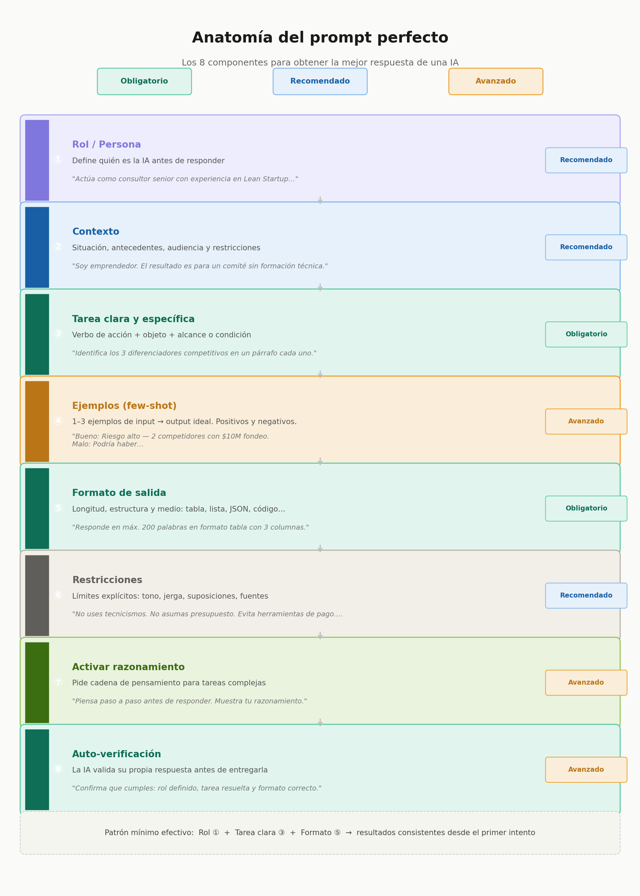

# Introducción

Revisión de Syllabus, revisión de proyectos potenciales e introducción a la innovación. De la idea al producto

## Syllabus

Tarea 1 descargar el Syllabus, entregar físicamente firmado, subirlo a sus páginas y mandar el documento al seleccionado para integrar todos los syllabus a un solo documento.

[Descargar el Syllabus (PDF)](./recursos/archivos/2026_Syllabus_Proyecto_Ingeniería_IV.pdf)

<iframe src="../recursos/archivos/2026_Syllabus_Proyecto_Ingeniería_IV.pdf" width="800" height="440"></iframe>

## TRL Nivel de madurez tecnológica (Technology Readiness Level) 

Puedes descargar el documento [aquí](https://docs.google.com/spreadsheets/d/1NYIhXmFSM3qvFPglLjnC4HzYIEPZL69n/edit?usp=sharing&ouid=118419766353546707509&rtpof=true&sd=true)

<iframe src="https://docs.google.com/spreadsheets/d/1NYIhXmFSM3qvFPglLjnC4HzYIEPZL69n/edit?usp=sharing&ouid=118419766353546707509&rtpof=true&sd=true" frameborder="0" width="1500" height="700" allowfullscreen="true" mozallowfullscreen="true" webkitallowfullscreen="true"></iframe>

  
    

# ¿Cómo usas la IA? 
  
    

# ¿Crees que la usas la IA para evitar pensar? 

  
    
      

## Prompting estructurado

{ width=600 align=center }

### Modos de prompt

| Modo |	Qué significa | Ejemplo |
| :--- | :---: | :---: |
| Prompting | Usar IA para generar material base | "Dame 20 formas de resolver X" |
| Remix | Tomar el resultado de la IA y transformarlo | "Ahora hazlo más raro / más simple / para un niño de 10 años" |
| Crítica | Pedir a la IA que desafíe tus propias ideas | "¿Qué tiene de malo este concepto?" |

### Ejercicio
>[!Tip]
>**El Desintoxicador digital analógico.**
Reto de la cena sagrada: *Diseña un dispositivo 100% analógico (sin pantallas, cables ni baterías) que impida físicamente que los comensales usen el teléfono celular durante una comida, convirtiendo la desconexión en un juego de mesa.*

>[!Warning]
>Tienes 20 segundos para hacer un prompt para que la IA de tu preferencia te de ideas

### Los 3 que más impacto tienen son

* El rol (orienta el tono y conocimiento que usará la IA)
* La tarea clara (un verbo de acción específico hace toda la diferencia)
* El formato de salida (la IA no adivina si quieres bullet points, tabla o código).

El error más común es dar contexto vago y omitir restricciones. Decirle a la IA qué NO hacer es tan poderoso como decirle qué sí hacer.

### El Rol

Ejemplos de cómo definir el rol para análisis de negocios, de menos a más sofisticado:

**Básico** — solo nombra la expertise:

"Actúa como consultor de negocios especializado en startups."

**Intermedio** — agrega metodología y audiencia:

"Actúa como consultor senior de estrategia con experiencia en Blue Ocean y Lean Startup. Tu audiencia son emprendedores latinoamericanos sin formación financiera, así que evita jerga técnica y usa ejemplos concretos."

**Avanzado** — rol + postura + restricciones de sesgo:

"Actúa como analista de negocios escéptico que busca debilidades antes que fortalezas. Tu trabajo es cuestionar supuestos, no validar ideas. Sé directo, usa datos cuando sea posible, y si no tienes certeza, dilo explícitamente en lugar de inventar."

El patrón que funciona mejor es: profesión + especialidad + metodología que usa + cómo se comporta + para quién habla. Cuanto más específico el rol, menos "genérica" se vuelve la respuesta.

### El Contexto

El contexto es la capa que más se subestima. La IA no tiene acceso a tu situación — todo lo que no escribas, lo inventa o lo promedia.

Hay 5 dimensiones de contexto que realmente cambian la respuesta:

1.**Quién eres tú.** No tu nombre, sino tu rol y nivel de expertise en el tema.

"Soy emprendedor con 3 años de experiencia, conozco el BMC pero nunca he hecho análisis de patentes."

2.**Para quién es el resultado.** La audiencia final cambia el tono, vocabulario y profundidad.

*"El output lo presentaré a un comité de funcionarios de gobierno, no a inversionistas."*

3.**Qué ya existe o ya hiciste.** Evita que la IA repita lo que ya sabes o rehaga trabajo hecho.

*"Ya tengo el análisis FODA. Lo que necesito es la estrategia, no el diagnóstico."*

4.**Restricciones reales.** Tiempo, presupuesto, tecnología disponible, limitaciones del equipo.

*"El equipo son 2 personas, presupuesto cero, necesito resultados en 2 semanas."*

5.**El "para qué" final.** La intención detrás de la tarea. Cambia completamente lo que la IA prioriza.

*"No quiero el análisis para publicar — es para decidir si pivoteo o sigo."*

**Ejemplo con y sin contexto** — misma tarea, resultados muy distintos:

❌ Sin contexto:

"Dame una estrategia de marketing para mi app."

✅ Con contexto:

"Tengo una app de validación de ideas para emprendedores en México, etapa pre-revenue, usuario típico es 25-35 años autodidacta. No tengo presupuesto para ads. Necesito una estrategia de adquisición orgánica para los primeros 500 usuarios. Ya probé posts en LinkedIn sin resultado."

**La regla práctica:** si al leer tu prompt alguien que no te conoce pudiera dar una respuesta genérica, falta contexto. El contexto perfecto hace que solo haya una respuesta correcta posible.

### La Tarea

La tarea es el núcleo del prompt. Todo lo demás la sirve. Si la tarea es vaga, el contexto y el rol no salvan la respuesta.

**La fórmula base:**

Verbo de acción + Objeto específico + Alcance o condición

Verbos que funcionan vs. verbos trampa:

| ❌ Vago |	✅ Específico |
| :--- | :---: |
| Ayúdame con…	| Redacta / Analiza / Compara |
| Dime algo sobre… |	Resume en 3 puntos clave |
| Explícame… | 	Extrae / Clasifica / Genera |
| Hazme un análisis |	Identifica los 5 riesgos principales |
| Dame ideas |	Propón 3 nombres con su justificación |

**El mismo objetivo, 3 niveles de claridad:**

❌ Malo:

"Ayúdame con mi producto."

⚠️ Regular:

"Analiza mi producto de vigilancia tecnológica."

✅ Bueno:

"Identifica los 3 principales diferenciadores competitivos de una app de vigilancia tecnológica para PYMES latinoamericanas, comparados con herramientas como Derwent y Espacenet, en un párrafo por diferenciador."

**3 técnicas avanzadas:**

**Ancla el resultado esperado** — describe el output, no el proceso:

"El resultado debe ser una tabla de decisión, no un texto explicativo."

**Usa restricciones numéricas** — acotan sin limitar creatividad:

"Exactamente 3 opciones. Ni más, ni menos."

**Separa tareas si hay más de una** — una tarea por prompt cuando sea posible, o enuméralas si van juntas:

"Haz dos cosas: ① resume el problema en una oración, ② propón una solución accionable esta semana."

**Ejemplo para el taller de innovación:**

*"Genera 4 actividades de calentamiento creativo para un taller de IA de 90 minutos dirigido a emprendedores sin conocimiento técnico. Cada actividad debe durar máximo 10 minutos, requerir cero tecnología, y conectar con el concepto de prompt engineering que verán después."*

**Verbo claro → objeto concreto → alcance definido → condiciones reales.**

## Business Blue Print

El **IDEO Business Blueprint** (enseñado a través de IDEO U) es un lienzo de una página que traza un modelo de negocio centrado en el ser humano.  Ayuda a los innovadores a probar y construir estrategias viables alineando las necesidades de los clientes, las fuentes de ingresos y las operaciones antes de lanzar. 

**Componentes Clave**

* **Clientes Objetivo:** Las personas o segmentos específicos a los que tu producto o servicio pretende servir. 
* **Propuesta de Valor:** El problema único que resuelves y el valor central que ofreces a esos usuarios. 
* **Oferta:** El producto, servicio o experiencia real que llevas al mercado. 
* **Modelo de Ingresos:** Cómo tu negocio generará dinero y capturará valor financiero. 
* **Estructura de Costos:** Los gastos clave y los costos operativos necesarios para ejecutar el modelo. 
* **Canales y Socios:** Cómo llegas a tus clientes y los socios clave que ayudan a entregar la oferta. 

**Las Tres Lentes del Diseño.** El plan se basa en equilibrar tres criterios fundamentales para la innovación: 

* **Deseabilidad:** ¿La gente lo necesita o lo quiere? 
* **Viabilidad:** ¿Puedes realmente construirlo y entregarlo? 
* **Factibilidad:** ¿Tiene sentido financiero como un negocio sostenible?

<iframe src="https://docs.google.com/presentation/d/1jeJDRBKeM7dOQuQLbjAwtsL4RQ0r0toh/edit?usp=sharing&ouid=118419766353546707509&rtpof=true&sd=true" frameborder="0" width="1500" height="700" allowfullscreen="true" mozallowfullscreen="true" webkitallowfullscreen="true"></iframe>

Puedes abrir [La presentación aquí](https://docs.google.com/presentation/d/1jeJDRBKeM7dOQuQLbjAwtsL4RQ0r0toh/edit?usp=sharing&ouid=118419766353546707509&rtpof=true&sd=true)

## Creatividad asistida: 	Generación de Ideas a Velocidad

### SCAMPER

El método **SCAMPER** es una técnica de creatividad e innovación. Sirve para generar ideas nuevas o mejorar productos, servicios y procesos que ya existen. Funciona como una lista de preguntas basadas en siete acciones

| Letra | Verbo | Qué preguntar |
| :--- | :---: | :---: |
| S | Sustituir | ¿Qué puedo reemplazar en esto? |
| C | Combinar | ¿Qué puedo fusionar con otra cosa? |
| A | Adaptar | ¿Qué existe que pueda tomar prestado? |
| M | Modificar / Magnificar | ¿Y si lo hago más grande, pequeño, rápido? |
| P | Poner en otros usos | ¿Quién más podría usar esto? |
| E | Eliminar | ¿Qué puedo quitar y que aún tenga valor? ¿Como puedo sustituir un componente crítico y sustituirlo con“algo” del contexto? |
| R | Revertir / Reorganizar | ¿Y si invierto el modelo por completo? |

### Ejemplo práctico por equipos de 2

**1 por parejas pidan a su IA que les de 3 números aleatorios entre 1 y 6**

<iframe src="https://docs.google.com/presentation/d/1ZgtCttUP-VrvMHlSQfRPNeacnGtFm5xyKU607va2-Xc/edit?usp=sharing" frameborder="0" width="1500" height="700" allowfullscreen="true" mozallowfullscreen="true" webkitallowfullscreen="true"></iframe>

Puedes abrir [el ejercicio SCAMPER aquí](https://docs.google.com/presentation/d/1ZgtCttUP-VrvMHlSQfRPNeacnGtFm5xyKU607va2-Xc/edit?usp=sharing)

## Propuesta de Proyectos

### Nuevas tecnologías en el IDIT

[**Antena Lora**](https://www.vencoel.com/que-es-lora-como-funciona-y-caracteristicas-principales/)

[**Antena RTK**](https://www.helixnorth.com/blog/sistema-georreferenciado-de-datos-rtk-y-ppk-cul-es-mejor)

<iframe width="560" height="315" src="https://www.youtube.com/embed/bCoIXgqlmTI" frameborder="0" allow="autoplay; encrypted-media" allowfullscreen></iframe>

[Proyecto Centipede en Francia](https://www.centipede-rtk.org/)

!!! tip "Sugerencia:"
    - [¿Bastón para ciegos autoguiado? / ¿Comandos de  voz por teléfono? RTK](https://www.linkedin.com/posts/explore-m%C3%A9dia_cette-technologie-redonne-de-lautonomie-activity-7333432446425710593-vzFB?utm_source=share&utm_medium=member_desktop&rcm=ACoAAAIEv6UBxHmoMGuYKeqpGdOKqwDPU1dzmVg)
    - [Tractor eléctrico autoguiado RTK](https://www.instagram.com/renewables247/) o bien otros productos
    - [Eliminador de hierba inteligente RTK](https://bumerania.com/soluciones-roboticas/robot-agricola-inteligente/)
    - [Geofencing para ganado RTK](https://www.halterhq.com/) [Otro enlace](https://www.instagram.com/halterhq/)
    - [Rep Rap Micron](https://www-hackster-io.cdn.ampproject.org/c/s/www.hackster.io/news/can-reprap-revolutionize-3d-printing-again-with-the-new-micron-design-18c4775e4d1a.amp), [All3DP](https://all3dp.com/es/4/nueva-impresora-3d-diy-de-precision-a-micronivel-de-un-pionero-de-reprap-pone-la-tecnologia-al-alcance-de-su-escritorio/) [Git](https://github.com/VikOlliver/RepRapMicron), [Vik](https://3dprintingindustry.com/news/interview-vik-olliver-first-reprap-volunteer-didnt-just-build-3d-printer-133892/)
    - Detección temprana de [movimiento de tierras](https://www.instagram.com/reel/DM-1UYGIEre/?utm_source=ig_web_copy_link&igsh=MzRlODBiNWFlZA==), [Deslaves CDMX](https://www.reforma.com/ubican-462-puntos-con-riesgo-de-deslave-o-inundacion-en-cdmx/ar2875886), [Atlas de riesgo](https://www.atlas.cdmx.gob.mx/analisisn3/), [Congreso pide atención](https://www.congresocdmx.gob.mx/comsoc-pide-congreso-acciones-atender-deslaves-cuajimalpa-5557-1.html)
    - Control Avícola Inteligente

!!! note "Tarea"
    - Entregar el syllabus firmado para la semana y colocar el syllabus firmado en la página de semana 1
    - Mandar al compañero seleccionado el pdf de su syllabus firmado para que lo recolecte en un solo archivo
    - Hacer sus páginas personales en github. Para esto pueden utilizar la plantilla y las instrucciones [en este repositorio](https://github.com/Gulden8ag/iberoP_Web)
    - Escribir la dirección de sus páginas en [Esta Lista](https://docs.google.com/spreadsheets/d/1K19NMJWUl0Xz4gGL0zMCp6Fc3yzoC8mmfAGNCUIXeGc/edit?usp=sharing) 
    - En equipo de 2 elegir el área de su interés para desarrollar su proyecto final. Si ya tienen proyecto, comenzar a ampliar las posibilidades del mismo
    - Hacer una presentación breve de su ejercicio SCAMPER