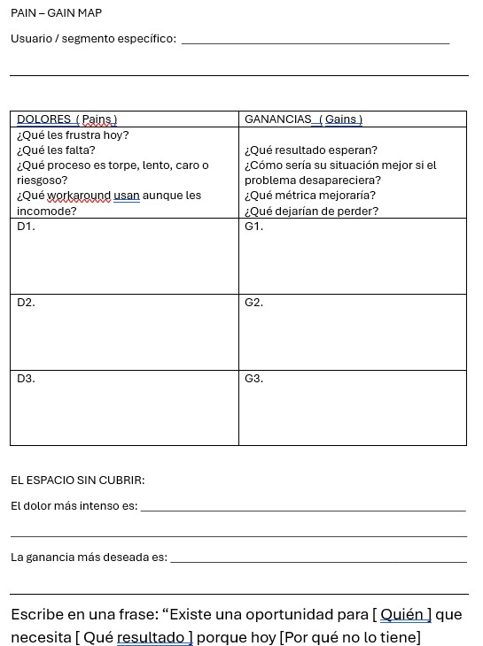

# Búsqueda de Oportunidades

## Objetivo de la semana

*Que el equipo identifique una oportunidad de producto concreta, arraigada en un problema observable en mercados latinoamericanos, usando IA como acelerador de búsqueda y síntesis — y elija la oportunidad que desarrollará durante el semestre.*

## Blueprint: **Creación de valor** · DVF: 🔴 Deseable

Esta semana el equipo responde la pregunta más importante del semestre antes de escribir una sola línea de código o hacer un solo modelo 3D: 

!!! tip "¿Existe un problema real que vale la pena resolver?"
    Todo lo que se construya después depende de la calidad de la respuesta que encuentren hoy.

## Cómo leer este documento

Cada paso tiene dos modos de instrucción que corren en paralelo:

🔍 **Modo Explorador** — equipos que buscan oportunidad desde cero

🔬 **Modo Estresor** — equipos que ya tienen una idea y necesitan cuestionarla

# Vista rápida de los 7 pasos

| **#** | **Paso** | **Tiempo** | **IA** |
| --- | --- | --- | --- |
| 1 | Búsqueda de oportunidades en LATAM con IA | 20 min | Perplexity + Claude / otra |
| 2 | Síntesis de insights con IA | 25 min | Claude / otra → Perplexity |
| 3 | Pain-Gain Map | 25 min | Claude / otra |
| 4 | SCAMPER + Remix de ideas | 20 min | Claude / otra |
| 5 | Validación preliminar de deseabilidad | 15 min | otra → Perplexity |
| 6 | Criterios de selección de oportunidad | 10 min | Sin IA |
| 7 | Elección y defensa de la oportunidad | 5 min / Tarea | Opcional |

## Paso 1 — Búsqueda de oportunidades en LATAM con IA 

Los alumnos que no tienen aún una idea de negocio entran en el Modo Explorador, buscaremos una serie de problemas **REALES** antes de elegir nada.

Para aquellos que ya tienen un proyecto que quieren desarrollar diremos que están en Modo Estresor, esto es necesitan ver su idea desde afuera: ¿qué tan saturado está ese espacio? ¿qué problemas adyacentes existen que no habían visto? ¿hay ángulos de negocio que su idea ya tiene pero que aún no explotan?

Usamos dos IAs en paralelo porque cada una tiene un perfil distinto y se compensan:

|   | **Perplexity** | **Claude** |
| --- | --- | --- |
| **Fortaleza** | Datos reales, fuentes verificables, cifras de mercado actualizadas | Síntesis creativa, conexiones no obvias, reencuadre de problemas |
| **Debilidad** | Tiende a lo obvio, repite el consenso del mercado | Sin datos propios — necesita que le des contexto |
| **Uso en este paso** | Anclar en realidad: ¿el problema existe, qué tan grande es, quién ya lo ataca? | Romper el consenso: ¿qué nadie está viendo, qué ángulo es contraintuitivo? |

Perplexity te dice qué existe. Claude te dice qué podría existir. Los necesitas a los dos para no quedarte ni con datos sin imaginación ni con imaginación sin datos.

!!! Warning "Instrucción general al grupo"
    "Vamos a buscar oportunidades con dos IAs en paralelo — no son intercambiables, cada una tiene un trabajo diferente. Perplexity para anclar en datos reales; Claude para romper el pensamiento obvio. Lean su tarjeta de modo y arranquen. Tienen 12 minutos de trabajo, luego compartimos hallazgos."

## **PROMPTS:** 

# 🔍 Modo Explorador

Ronda 1 — **Perplexity:** anclar en realidad (6 min)

Actúa como un analista senior de oportunidades de negocio con
experiencia en mercados emergentes de América Latina, especializado
en identificar problemas donde una solución digital-física integrada 
puede generar tracción comercial real. Tu metodología combina
análisis de brechas de mercado, detección de comportamientos
no atendidos y evaluación de disposición a pagar en contextos
de recursos limitados.

Somos un equipo de emprendedores en México desarrollando un
negocio basado en producto digital-físico. Nuestro stack incluye:
desarrollo de aplicaciones móviles y web con IA integrada,
hardware conectado (ESP32, Raspberry Pi, sensores, actuadores,
comunicaciones BLE/MQTT/WiFi), diseño y manufactura de producto
físico (CAD, impresión 3D, PCB), e integración de modelos de IA
tanto en dispositivo como en la nube. El resultado que buscamos
es un negocio con tres componentes articulados: una aplicación
con IA, un artefacto físico inteligente y una página web de
venta con propuesta de valor clara. Tenemos seis meses para
llegar a un MVP comercializable y validado.

Identifica 4 oportunidades de negocio no resueltas o mal resueltas
en el sector de *[ELIGE el área que hayas pensado o bien uno de estos que te atraiga: salud comunitaria / manufactura artesanal / logística urbana / agua y medio ambiente / seguridad física / educación técnica]* en México y América Latina que cumplan estas
condiciones:

- El problema ocurre de forma frecuente (semanal o diaria) y
  tiene un costo observable para el usuario

- Existe evidencia de que la gente ya paga por soluciones
  imperfectas o pierde tiempo y dinero por no tenerlas

- La oportunidad se puede atacar con una solución que combine
  inteligencia artificial, interfaz digital y componente físico

- El mercado potencial en LATAM supera las 50,000 personas o 
  negocios con disposición real a pagar

Para cada oportunidad entrega:

1. El problema concreto: quién lo tiene, cuándo ocurre, cuánto 
   le cuesta no resolverlo

2. La solución actual más usada y por qué sigue siendo insuficiente

3. Por qué una solución que combine app con IA + artefacto físico
   inteligente es el enfoque correcto para este problema

4. Estimado del tamaño de mercado en LATAM con fuente 

No propongas soluciones tecnológicas todavía. Solo problemas con contexto de mercado suficiente para evaluar su potencial.

--------------------------------------------------------------------------------

**Ronda 2 — Claude / otra:** romper el consenso (6 min)

Una vez que Perplexity te devuelve las 4 oportunidades, llevas los resultados a Claude:

Actúa como un innovador con experiencia en detectar oportunidades de negocio que el mercado ignora porque parecen demasiado nicho,
demasiado obvias o demasiado difíciles. Tu enfoque es el pensamiento lateral aplicado a mercados emergentes: buscas lo que todos ven pero nadie está atacando, y lo que nadie ve porque está demasiado cerca. Tienes especial habilidad para imaginar negocios donde la combinación de inteligencia artificial, interfaces digitales y objetos físicos inteligentes crea una propuesta de valor que ninguno de los tres componentes podría crear por separado.

Estamos construyendo un negocio en México con tres componentes articulados: una aplicación con IA, un artefacto físico inteligente y una página web de venta. Nuestras capacidades abarcan tanto el desarrollo de software e IA como el diseño y manufactura de hardware conectado. Tenemos seis meses para llegar a MVP comercializable.

Estas son las 4 oportunidades que identificamos a través de análisis de mercado:

*[PEGA AQUÍ los resultados de Perplexity]*

Necesito que hagas 3 cosas:

1. ROMPE EL CONSENSO: ¿Cuál de las 4 oportunidades está siendo 
   atacada de la forma más predecible? ¿Qué ángulo contraintuitivo
   nadie está viendo porque todos asumen lo mismo sobre ese
   problema? ¿Cómo cambiaría la propuesta de valor si el artefacto
   físico, la app y la web de venta se articularan de una forma
   no convencional?

2. ENCUENTRA EL PROBLEMA OCULTO: Debajo de estas 4 oportunidades
   superficiales, ¿cuál es el problema raíz que, si se resolviera
   con una solución digital-física integrada, haría innecesarios
   2 o más de estos problemas al mismo tiempo? ¿Qué negocio
   emerge de resolver ese problema raíz?

3. EL SEGMENTO IGNORADO: ¿Hay algún grupo de usuarios que tiene
   estos problemas con el doble de intensidad pero que no aparece
   en los análisis de mercado convencionales porque no tiene voz
   digital — no escribe en foros, no da entrevistas, no aparece
   en reportes — pero que claramente existe en la realidad
   mexicana y tiene disposición real a pagar?

No me repitas lo que Perplexity ya encontró. Dame lo que el análisis de mercado convencional no puede ver.

### Qué anotar

De Perplexity: las 2 oportunidades con más evidencia de mercado (datos, tamaño, costo observable del problema).

De Claude: el ángulo no obvio más prometedor — puede ser una nueva lectura de una oportunidad ya identificada, el problema raíz oculto, o el segmento ignorado.

Llevas estos 3 insumos al Paso 2.

----------------------------------------------------------------------------------------------------------------------------------

# 🔬 Modo Estresor

Ronda 1 — **Perplexity:** auditoría de ecosistema (6 min)

Actúa como un analista de inteligencia competitiva especializado en negocios de producto digital-físico en América Latina, con experiencia en evaluar si una idea tiene espacio real en el mercado o si está entrando a un ecosistema ya saturado o con barreras no obvias. Tu metodología incluye análisis de actores existentes, detección de brechas no cubiertas, identificación de mercados adyacentes y evaluación de timing de mercado.

Somos un equipo de emprendedores en México construyendo un negocio basado en tres componentes articulados: una aplicación con IA, un artefacto físico inteligente y una página web de venta. Nuestras capacidades abarcan desarrollo de software e IA, hardware conectado (ESP32, Raspberry Pi, sensores, PCB) y manufactura de producto físico. Tenemos seis meses para llegar a MVP comercializable.

Nuestra idea actual es:

*[DESCRIBE TU IDEA EN 3–4 ORACIONES: qué hace, para quién, cómo se articulan los tres componentes — app, artefacto y página de venta — y qué problema cree el equipo que resuelve]*

Responde con datos verificables y fuentes:

1. SATURACIÓN DEL ESPACIO: ¿Quién más está atacando este problema
   en LATAM o en el mundo con soluciones que combinen software, 
   IA y hardware? Menciona al menos 3 actores reales con su nivel 
   de tracción actual.

2. BRECHAS NO CUBIERTAS: En el mismo espacio donde opera nuestra 
   idea, ¿qué subproblemas o segmentos de usuario están siendo 
   ignorados por los actores actuales? Dame 3 brechas concretas 
   con evidencia de que son reales y de que representan disposición 
   a pagar.

3. MERCADOS ADYACENTES: ¿Hay sectores o tipos de usuario donde 
   una solución como la nuestra — app con IA + artefacto físico + canal de venta digital — podría aplicarse con adaptaciones 
   menores y donde el problema sea igual o más intenso?

4. TIMING: ¿Hay señales de que este mercado está listo para una 
   solución integrada digital-física ahora? ¿Qué tendencia 
   reciente lo indica o lo contradice?

Ronda 2 — **Claude / Otra:** estrés profundo de la idea 

Actúa como un inversionista con experiencia en negocios de producto digital-físico en mercados emergentes, conocido por hacer las preguntas que los equipos no quieren escuchar pero necesitan responder antes de comprometer seis meses en una idea.

No eres destructivo — eres brutalmente honesto porque te importa que el negocio llegue a algo real y comercializable.

Somos emprendedores en México. Nuestra idea es:

*[DESCRIBE TU IDEA EN 3–4 ORACIONES]*

Nuestro modelo de negocio tiene tres componentes: una aplicación con IA, un artefacto físico inteligente y una página web de venta. 

Nuestras capacidades: desarrollo de software e IA, hardware conectado, manufactura de producto físico. Tenemos seis meses para llegar a MVP comercializable.

Este es el análisis de ecosistema que encontramos:

*[PEGA AQUÍ los resultados de Perplexity]*

Hazme el estrés que más necesito — no el más cómodo:

1. EL SUPUESTO MÁS PELIGROSO: ¿Cuál es el supuesto sobre el 
   usuario o el mercado que estamos dando por hecho y que, si 
   resulta falso, hace que toda la idea pierda sentido? ¿Cómo 
   lo probaríamos o refutaríamos en menos de una semana sin 
   construir nada?

2. LA ARISTA QUE NO VIMOS: Basándote en las brechas del análisis 
   de ecosistema, ¿hay una versión de nuestro negocio — 
   manteniendo los tres componentes pero cambiando el usuario 
   objetivo, el problema atacado o cómo se articulan app, 
   artefacto y canal de venta — que tenga un mercado más claro 
   o una propuesta de valor más fuerte? Descríbela como pitch 
   de 3 oraciones.

3. EL PIVOTE MÍNIMO: Si tuvieras que cambiar UNA sola cosa de 
   nuestra idea para hacerla significativamente más fuerte — 
   el usuario objetivo, el problema central, la forma en que 
   los tres componentes se relacionan entre sí, o el modelo 
   de ingresos — ¿qué cambiarías y por qué?

Sé específico. No me des frameworks — dame decisiones accionables.

**Qué anotar**

De Perplexity: las 2 brechas más concretas que los actores actuales no están cubriendo.

De Claude: el supuesto más peligroso que el equipo necesita probar, y la arista alternativa más prometedora.

Llevas estos 3 insumos al Paso 2.

## Paso 2 — Síntesis de insights con IA

El Paso 1 produjo datos: oportunidades con cifras de mercado, brechas identificadas, ángulos no obvios. El problema es que los datos dispersos no toman decisiones — los insights sí.

!!! tip "Insight" 
    Un insight de negocio no es un dato recopilado ni una observación general. Es una afirmación específica que revela por qué un problema persiste, quién lo sufre más, qué lo hace difícil de resolver, y qué tan caro le resulta al usuario seguir sin solución. 
    
    Un buen insight señala exactamente dónde existe la oportunidad de negocio — y hace que sea difícil ignorarla.

En este paso usamos dos IAs con roles distintos:

|   | Claude | Perplexity |
| --- | --- | --- |
| Trabajo | Sintetizar y estructurar los hallazgos del Paso 1 en insights accionables | Verificar y anclar los insights con datos reales cuando Claude los genera sin fuente |
| Cuándo usarlo | Primero — para construir el insight | Segundo — para validar que el costo del problema y el tamaño de mercado del insight son reales |

### La diferencia entre dato e insight no es de forma — es de utilidad para tomar decisiones. El instructor muestra estos dos ejemplos en pantalla sin comentario adicional. Los equipos los leen y el instructor pregunta: "¿Cuál de los dos les dice qué hacer?"

| Esto es un dato | Esto es un insight |
| --- | --- |
| "Hay problemas de riego en agricultura de pequeña escala en México" | "Los agricultores de 1–5 hectáreas en Sonora toman decisiones de riego basadas en experiencia táctil — aprietan un puñado de tierra. Eso les genera pérdidas de 15–30% de cosecha por ciclo. Los sensores de humedad profesionales cuestan entre $200 y $2,000 USD — más de lo que ganan en un ciclo de cultivo de tomate. El problema no es falta de tecnología: es que la tecnología existente cuesta más de lo que el problema cuesta. Ahí está el espacio." |
| "Las tiendas pequeñas tienen problemas de seguridad" | "Las tiendas de abarrotes en zonas periurbanas de CDMX y GDL sufren robo hormiga por parte de empleados y clientes — no robo a mano armada. Las pérdidas representan entre $3,000 y $8,000 MXN mensuales según registros del INEGI. Los sistemas de CCTV profesionales cuestan $15,000–40,000 MXN de instalación. La solución actual es 'revisar la cámara cuando ya pasó algo' — reactiva, no preventiva. Nadie está usando visión por computadora + alerta en tiempo real a ese precio." |

### El insight nombra al usuario específico, cuantifica el costo del problema, explica por qué las soluciones actuales no bastan, y señala exactamente dónde está el espacio de negocio.

### 🔍 Modo Explorador

Ronda 1 — Claude: construir el insight (12 min)

Tomas los 3 insumos del Paso 1 (2 oportunidades con datos + 1 ángulo no obvio) y los llevas a Claude:

PROMPT

Actúa como un estratega de innovación con experiencia en traducir hallazgos de mercado en insights de negocio accionables para emprendedores que construyen productos digitales-físicos. Tu especialidad es encontrar la formulación exacta que revela por qué un problema persiste y dónde está el espacio real de negocio — no el espacio teórico.

Somos un equipo de emprendedores en México desarrollando un negocio con tres componentes articulados: una aplicación con IA, un artefacto físico inteligente y una página web de venta. Nuestras capacidades abarcan desarrollo de software e IA, hardware conectado (ESP32, Raspberry Pi, sensores, PCB) y manufactura de producto físico. Tenemos seis meses para llegar a un MVP comercializable. Estamos en la etapa de selección de oportunidad — aún no hemos elegido en qué problema trabajar.

Estos son los hallazgos de nuestra búsqueda de mercado:

[PEGA AQUÍ los 3 insumos del Paso 1:

 - Las 2 oportunidades con datos de Perplexity

 - El ángulo no obvio de Claude]

Necesito que hagas lo siguiente:

1. SINTETIZA EN INSIGHTS: Convierte cada oportunidad en un 
   insight estructurado con este formato exacto: 

    * Quién específico tiene el problema (segmento concreto, no "los usuarios" ni "las empresas")

    * Qué les cuesta no resolverlo (tiempo, dinero, calidad, riesgo — con cifra o estimado)

    * Por qué las soluciones actuales no bastan (no "son caras" en abstracto — cuál es la razón específica por la que fallan para este usuario)

    * Dónde está exactamente el espacio: la brecha entre lo que existe y lo que se necesita

2. ELIGE Y JUSTIFICA: 
    * De los insights generados, ¿cuál tiene el espacio de negocio más claro para una solución que combine app con IA + artefacto físico + canal de venta digital?

    * Justifica en función del usuario, el costo del problema y la viabilidad de los tres componentes juntos.

3. FORMULA EL INSIGHT GANADOR: Redacta el insight elegido en 3–4 oraciones que cualquier persona pudiera leer y entender por qué es una oportunidad real. Sin jerga. Sin abstracciones.

Ronda 2 — **Perplexity:** verificar los números (8 min)

Claude construyó el insight — pero sus cifras son estimaciones, no datos verificables. Antes de comprometer seis meses con una oportunidad, necesitas saber si los números son reales.

Tomas el insight ganador y lo llevas a Perplexity:

**PROMPT:** 

Actúa como un analista de inteligencia de mercado especializado en validación de oportunidades de negocio en América Latina, con acceso a fuentes primarias y secundarias confiables: INEGI, BID, CEPAL, reportes sectoriales, bases de datos de startups y registros de comportamiento de mercado. Tu trabajo es separar los supuestos de los hechos verificables — no para destruir ideas, sino para que los emprendedores sepan exactamente en qué parte de su oportunidad están parados sobre roca y en qué parte están parados sobre arena.

Somos emprendedores en México construyendo un negocio con tres componentes: una aplicación con IA, un artefacto físico inteligente y una página web de venta. Identificamos una oportunidad de negocio a través de análisis de mercado y necesitamos verificar si sus afirmaciones clave tienen respaldo en datos reales antes de comprometer seis meses de desarrollo.

Este es el insight que necesitamos verificar:

*[PEGA AQUÍ el insight ganador que generó Claude]*

Verifica cada una de estas afirmaciones con fuentes citables:

1. SEGMENTO: ¿El usuario descrito existe con ese perfil y ese problema en México o LATAM? ¿Cuántos son aproximadamente?
   Busca en INEGI, reportes de organismos multilaterales (BID, CEPAL, FAO, OPS según el sector), o estudios sectoriales recientes. Si el dato exacto no existe, dame el proxy más cercano con su fuente.

2. COSTO DEL PROBLEMA: ¿La cifra de pérdida o costo que menciona el insight tiene respaldo en datos reales?

   Si no hay dato exacto, ¿cuál es el rango documentado más cercano?
    ¿Hay comportamiento observable que lo confirme — pagos actuales a soluciones imperfectas, pérdidas documentadas, seguros contratados, workarounds que tienen costo?

3. SOLUCIONES ACTUALES: ¿Las alternativas que el insight describe como insuficientes existen realmente y tienen las características y precios que se  mencionan? Dame al menos 2 ejemplos concretos con precio real y limitación verificable.

4. DISPOSICIÓN A PAGAR: ¿Hay evidencia de que este mercado en LATAM está dispuesto a pagar por una solución mejor? 
   Busca señales de comportamiento: ¿ya pagan por algo similar aunque sea peor? ¿hay búsquedas activas documentadas? 
   ¿comunidades online donde buscan soluciones? ¿intentos de crowdfunding o mercados informales activos?

Al terminar, dame un veredicto por afirmación:

✅ Verificada con fuente

⚠️ Plausible pero sin dato directo — proxy usado

❌ No encontré respaldo — el equipo necesita validar esto
   con usuarios reales antes de continuar

Sé directo. Un insight mal fundamentado descubierto hoy vale más que uno descubierto en seis meses.

-------------------------------------------------------------------------------------------------------------------------------

Al final del Paso 2 se obtiene un insight verificado con esta estructura:

INSIGHT DE OPORTUNIDAD — [Nombre del equipo]

QUIÉN: [Segmento específico con tamaño estimado verificado]

EL PROBLEMA: [Qué les ocurre, cuándo, con qué frecuencia]

LO QUE LES CUESTA: [Cifra o rango verificado — tiempo, dinero o riesgo]

POR QUÉ NO ESTÁ RESUELTO: [Razón específica por la que las soluciones actuales fallan para este usuario]

EL ESPACIO: [La brecha exacta entre lo que existe y lo que se necesita — donde vive el negocio]

FUENTES: [Las 2–3 fuentes que verificó Perplexity]

VEREDICTO DE VERIFICACIÓN: [✅ / ⚠️ / ❌ por afirmación]

### 🔬 Modo Estresor

**Ronda 1** — Claude: auditoría del insight implícito 

Toda idea de negocio tiene un insight implícito — una afirmación sobre el usuario y el problema que el equipo da por cierta sin haberla formulado explícitamente. El objetivo de esta ronda es hacerlo visible para poder cuestionarlo.

**Prompt**

Actúa como un estratega de producto con experiencia en identificar los supuestos ocultos detrás de ideas de negocio — los insights implícitos que los equipos dan por ciertos sin haberlos formulado ni verificado. Tu especialidad es hacer visible lo que se asume como obvio, porque ahí es donde más frecuentemente fallan los negocios de hardware + software en mercados emergentes.

Somos un equipo de emprendedores en México con una idea de negocio que combina tres componentes: una aplicación con IA, un artefacto físico inteligente y una página web de venta. Nuestras capacidades: desarrollo de software e IA, hardware conectado, manufactura de producto físico. Tenemos seis meses para MVP comercializable.

Nuestra idea es:

*[DESCRIBE LA IDEA EN 3–4 ORACIONES]*

Del análisis de ecosistema del Paso 1 obtuvimos esto:

*[PEGA LOS 3 INSUMOS DEL PASO 1: brechas de Perplexity + supuesto peligroso y arista alternativa de Claude]*

Necesito que hagas tres cosas:

1. FORMULA EL INSIGHT IMPLÍCITO: ¿Cuál es el insight sobre el 
   usuario y el problema que nuestro equipo está dando por
   cierto sin haberlo verificado? Exprésalo en el mismo formato
   que usarías para un insight sólido: quién, qué les cuesta,
   por qué no está resuelto, dónde está el espacio.
   Sé preciso — no parafrasees nuestra idea, formula el
   supuesto que la sostiene.

2. AUDITA EL INSIGHT: Una vez formulado, dime:

   * ¿Qué parte del insight tiene más probabilidad de ser falsa o más débil de lo que asumimos?

   * ¿Qué evidencia necesitaríamos para saber si es verdadera?

   * ¿Hay una versión alternativa del insight — mismo problema, diferente usuario, o mismo usuario, diferente problema — que podría ser más sólida?

3. FORMULA EL INSIGHT DE LA ARISTA NUEVA: Usando la arista alternativa que encontramos en el Paso 1, formula un segundo insight con el mismo formato. ¿Para quién es, qué les cuesta, por qué no está resuelto, dónde está el espacio? ¿Cómo se articularían los tres componentes del negocio — app, artefacto y canal de venta — alrededor de esta arista?

**Ronda 2** — Perplexity: verificar y comparar ambos insights 

Tienes dos insights: el de tu idea original y el de la arista nueva. Necesitas datos reales para los dos antes de decidir cuál defender en el Paso 7. No es una comparación de opiniones — es una comparación de evidencia.

**Prompt**

Actúa como un analista de inteligencia competitiva con experiencia en evaluar la solidez de oportunidades de negocio digital-físico en mercados emergentes latinoamericanos. Tu metodología consiste en contrastar las afirmaciones de una oportunidad con datos verificables de fuentes primarias y secundarias — INEGI, BID, CEPAL, reportes de industria, bases de datos de comportamiento de mercado — para determinar qué tan firme es el suelo sobre el que un emprendedor está parado antes de comprometer recursos.

Somos emprendedores en México desarrollando un negocio que combina tres componentes: una aplicación con IA, un artefacto físico inteligente y una página web de venta. Tenemos dos direcciones posibles de negocio y necesitamos datos reales para elegir la más sólida, no la más atractiva en papel.

INSIGHT A — nuestra idea original:

*[PEGA EL INSIGHT IMPLÍCITO FORMULADO POR CLAUDE]*

INSIGHT B — arista alternativa identificada:

*[PEGA EL INSIGHT DE LA ARISTA NUEVA]*

Para cada insight, verifica con fuentes citables:

1. EXISTENCIA Y TAMAÑO DEL SEGMENTO: ¿El usuario descrito 
   existe con ese perfil y ese problema en México o LATAM?
   ¿Cuántos son? Dame la fuente más específica disponible
   — si no hay dato exacto, el proxy más cercano con origen.

2. COSTO REAL DEL PROBLEMA: ¿Hay datos documentados — 
   pérdidas reportadas, pagos observables a soluciones
   imperfectas, costos de workarounds — que respalden el 
   costo que cada insight describe? ¿O es una estimación 
   sin respaldo directo?

3. COMPETENCIA ESPECÍFICA: ¿Hay actores en el mercado 
   atacando exactamente esta combinación de usuario + 
   problema + solución digital-física para cada insight?
   No el problema genérico — esta combinación específica.
   Menciona actores reales con tracción observable.

4. SEÑAL DE MERCADO MÁS FUERTE: ¿Cuál de los dos insights 
   tiene más evidencia de que el mercado está listo — pagos 
   actuales, búsquedas documentadas, comunidades activas, 
   intentos previos de solución con tracción?

Al terminar entrega una tabla comparativa:

| Criterio          | Insight A | Insight B |

|-------------------|-----------|-----------|

| Segmento verificado | ✅/⚠️/❌ | ✅/⚠️/❌ |

| Costo documentado   | ✅/⚠️/❌ | ✅/⚠️/❌ |

| Competencia mapeada | ✅/⚠️/❌ | ✅/⚠️/❌ |

| Señal de mercado    | ✅/⚠️/❌ | ✅/⚠️/❌ |

No me digas cuál elegir — dame los datos y deja que la evidencia hable por sí sola.

Qué conseguimos al final del Paso 2

Dos insights comparados con evidencia verificada:

INSIGHT A — Idea original

[Formato completo: quién, costo, por qué no resuelto, espacio]

Tabla de verificación: [✅ / ⚠️ / ❌ por criterio]

Fuentes: [las que encontró Perplexity]

INSIGHT B — Arista nueva

[Formato completo: quién, costo, por qué no resuelto, espacio]

Tabla de verificación: [✅ / ⚠️ / ❌ por criterio]

Fuentes: [las que encontró Perplexity]

DECISIÓN PROVISIONAL: ¿Cuál llevan al Paso 3?

(pueden llevar los dos si ambos tienen evidencia sólida — el Paso 3 los ayudará a decidir con el Pain-Gain Map)

----------------------------------------------------------------------------------

## Paso 3 — Pain-Gain Map

El Paso 2 produjo un insight verificado: sabemos quién tiene el problema, qué les cuesta y por qué no está resuelto. El Paso 3 convierte ese insight en una radiografía del usuario — un mapa que descompone exactamente qué lo frustra (dolores) y qué resultado desea obtener (ganancias).

!!! warning 
    La oportunidad de negocio vive en el cruce entre el dolor más intenso y la ganancia más deseada que ninguna solución actual entrega. El Pain-Gain Map hace ese cruce visible y específico.

    Este paso es principalmente analógico — papel, marcadores, conversación de equipo. La IA entra al final, no al principio, para ampliar lo que el equipo construyó con su propio criterio.

En este paso usamos dos IAs con roles distintos:

|   | Claude | Perplexity |
| --- | --- | --- |
| **Trabajo** | Ampliar y cuestionar el mapa construido por el equipo — encontrar dolores que no vieron, ganancias que subestimaron, y entregar el mapa completo en formato listo para usar | Verificar que los dolores identificados son reales y frecuentes con datos de comportamiento de usuarios en LATAM |
| **Cuándo usarlo** | Después de que el equipo construyó su mapa en papel — no antes | Solo si algún dolor del mapa necesita verificación de frecuencia o intensidad real |

"El Pain-Gain Map es una radiografía del usuario — no de su producto ni de su idea. Dos columnas: qué le duele y qué quiere ganar. La oportunidad está donde el dolor es más intenso y la ganancia más deseada todavía no la da nadie bien. Tienen 10 minutos para construirlo en papel antes de tocar cualquier IA."

!!! warning "Regla crítica"
    "La columna de dolores se llena con lo que el usuario experimenta hoy — no con lo que su producto resuelve. Si están escribiendo en los dolores lo que su solución hace, están llenando el mapa al revés."

Plantilla Pain Gain Map

{ width=600 align=center }

Puedes descargar la plantilla del Pain - Gain Map [aquí](https://docs.google.com/document/d/1ePOtMxb2JJMDOwvK_1xki2dBD9rRyQQX/edit?usp=sharing&ouid=118419766353546707509&rtpof=true&sd=true)

### 🔍 Modo Explorador
Ronda 1 — Construcción en papel 

Antes de abrir cualquier IA, el equipo llena el mapa con su propio criterio a partir del insight del Paso 2.

!!! tip "Para llenar los dolores — tres preguntas guía:"
    * ¿Qué hace el usuario HOY para resolver este problema, aunque sea de forma mala, costosa o incómoda? Ese workaround contiene los dolores más reales.
    * ¿Qué parte de ese workaround le sigue fallando o frustrando?
    * ¿Qué pierde en tiempo, dinero, calidad o tranquilidad por no tener una solución mejor?

!!! warning "Para llenar las ganancias — tres preguntas guía:"
    * Si el problema desapareciera mañana, ¿qué cambiaría concretamente en su día o en su negocio?
    * ¿Qué métrica específica mejoraría? (menos horas, menos costo, menos errores, más ventas, menos riesgo)
    * ¿Qué podría hacer que hoy no puede hacer porque el problema se lo impide?

Al terminar el mapa en papel, identificar:

* El dolor más intenso: el que le cuesta más no resolver (en dinero, tiempo o riesgo)

* La ganancia más deseada: el resultado que más quiere obtener

* ¿Hay alguna solución actual que cubra exactamente ese cruce? Si no, ahí está el espacio.

Ronda 2 — Claude: ampliar, cuestionar y entregar el mapa final

Transcribe tu mapa y llevalo a Claude. El prompt incluye instrucciones de formato de salida para que Claude entregue directamente el mapa completo listo para usar:

Actúa como un investigador de experiencia de usuario con especialización en comportamiento de consumidores y pequeños empresarios en mercados latinoamericanos. Tu metodología combina análisis de fricción de producto, mapeo de deseos no articulados y detección de dolores que los usuarios normalizan — los que no mencionan en una primera conversación porque asumen que no tienen solución. Tienes especial habilidad para encontrar lo que un 
equipo de producto no ve porque está demasiado enfocado en su propia solución.

Somos un equipo de emprendedores en México desarrollando un negocio con tres componentes articulados: una aplicación con IA, un artefacto físico inteligente y una página web de venta. 

Construimos este Pain-Gain Map sobre nuestro usuario objetivo a partir de un insight de mercado verificado. Ahora necesitamos que lo amplíes y lo cuestiones — no que lo valides.

Nuestro usuario / segmento: *[DESCRIBE EL SEGMENTO DEL INSIGHT]*

Nuestro insight verificado: *[PEGA EL INSIGHT DEL PASO 2]*

Nuestro Pain-Gain Map construido hasta ahora:

DOLORES que identificamos:

- D1: *[pega]*

- D2: *[pega]*

- D3: *[pega]*

GANANCIAS que identificamos:

- G1: *[pega]*

- G2: *[pega]*

- G3: *[pega]*

Necesito que hagas tres cosas y que entregues el resultado en el formato exacto que te indico al final:

1. DOLORES QUE NO VIMOS: ¿Qué dolores reales tiene este    usuario que nuestro mapa no capturó? Enfócate en:

   * Dolores que los usuarios normalizan y rara vez mencionan porque creen que no tienen solución

   * Dolores emocionales o de estatus (vergüenza, frustración, sensación de pérdida de control) que acompañan al dolor funcional que ya identificamos

   * Dolores que aparecen ANTES o DESPUÉS del momento principal del problema — el contexto que rodea la fricción

   Agrega mínimo 2 dolores adicionales específicos para este usuario en contexto LATAM.

2. GANANCIAS QUE SUBESTIMAMOS: ¿Qué resultados deseados tiene este usuario que nuestro mapa minimiza o ignora?

   Enfócate en ganancias de segundo orden — lo que cambia 
   en su vida o negocio como consecuencia de resolver el 
   problema principal, no solo el resultado directo.

   Agrega mínimo 2 ganancias adicionales con ese enfoque.

3. EL CRUCE MÁS PODEROSO: Con el mapa ampliado, identifica 
   la combinación de dolor más intenso + ganancia más deseada 
   que representa el espacio de negocio más claro para una 
   solución que combine app con IA + artefacto físico + 
   canal de venta digital. Explica en 2 oraciones por qué 
   ese cruce específico y no otro.

FORMATO DE SALIDA — entrega exactamente esto, sin agregar texto antes ni después:

═══════════════════════════════════════════════════════

PAIN-GAIN MAP COMPLETO

Usuario / segmento: [el segmento específico]

═══════════════════════════════════════════════════════

DOLORES (ordenados de mayor a menor intensidad):

⭐ D1: [el más intenso — original o nuevo]

   D2: [segundo más intenso]

   D3: [tercer más intenso]

   D4: [agregado — dolor normalizado que no vieron]

   D5: [agregado — dolor emocional o de contexto]

GANANCIAS (ordenadas de mayor a menor deseo):

⭐ G1: [la más deseada — original o nueva]

   G2: [segunda más deseada]

   G3: [tercera más deseada]

   G4: [agregada — ganancia de segundo orden]

   G5: [agregada — ganancia de segundo orden]

EL CRUCE MÁS PODEROSO:

Dolor ⭐ [nombre] × Ganancia ⭐ [nombre]

[2 oraciones explicando por qué este cruce y no otro]

LA OPORTUNIDAD EN UNA ORACIÓN:

"Existe una oportunidad para [quién] que necesita [qué resultado]

porque hoy [por qué no lo tiene]."

═══════════════════════════════════════════════════════

Ronda 3 — Perplexity: verificar frecuencia e intensidad

Solo si el equipo tiene dudas sobre qué tan frecuente o intenso es el dolor ⭐ del mapa. No es obligatoria si el insight del Paso 2 ya verificó esto.

Actúa como un analista de comportamiento de mercado con experiencia en documentar cómo usuarios en América Latina experimentan y expresan sus problemas — en foros, redes sociales, comunidades de práctica, reseñas de productos y reportes sectoriales. Tu especialidad es encontrar evidencia de primera mano de que un problema específico duele de forma frecuente e intensa, no solo de que existe en abstracto.

Somos emprendedores en México que identificamos el siguiente dolor como el más intenso de nuestro usuario y queremos verificar si esa intensidad y frecuencia tienen respaldo en comportamiento real antes de construir un negocio alrededor de él.

USUARIO / SEGMENTO: [del Pain-Gain Map]

DOLOR PRINCIPAL A VERIFICAR: [el dolor ⭐ del mapa]

Verifica con evidencia de comportamiento real — no estadísticas generales — y entrega tu respuesta en este formato exacto:

FRECUENCIA

¿Con qué regularidad experimenta este usuario este dolor?

Evidencia encontrada: [dónde y cómo lo expresan — comunidades, foros, grupos, canales — con ejemplos concretos y links si están disponibles]

Veredicto: diario / semanal / mensual / ocasional

INTENSIDAD

¿Qué tan caro o incómodo es en términos observables?

Evidencia encontrada: [pagos actuales, workarounds con costo, pérdidas documentadas atribuibles a este dolor específico]

Veredicto: alto / medio / bajo

MOMENTO

¿Cuándo ocurre exactamente en el flujo de trabajo o vida del usuario?

[descripción del momento preciso donde intervenir]

Tipo: continuo / periódico / situacional

CONCLUSIÓN PARA EL EQUIPO:

[Una oración directa: el dolor ⭐ está bien fundamentado / necesita ajuste / es menos intenso de lo que asumieron]

--------------------------------------------------------------------------------

### 🔬 Modo Estresor
El Estresor no construye el mapa desde cero — lo usa como herramienta de auditoría en tres rondas progresivas. El objetivo no es llenar un mapa bonito, sino descubrir si la idea ataca los dolores correctos y si hay aristas de negocio que el equipo no ha visto.
Ronda 1 — Construcción honesta en papel (8 min)
El equipo llena el mapa desde la perspectiva del usuario, no desde la perspectiva de su idea.

Instrucción específica: llenar los dolores con lo que el usuario experimenta hoy, antes de que la idea del equipo exista. No lo que la idea resuelve — lo que el usuario vive.

Al terminar, marcar cada dolor con uno de tres símbolos:

✅ Nuestra idea lo resuelve bien
⚠️ Nuestra idea lo atenúa parcialmente
❌ Nuestra idea no lo toca

La pregunta incómoda antes de abrir Claude: ¿el dolor marcado con ❌ o ⚠️ es más intenso que el que nuestra idea resuelve con ✅? Si la respuesta es sí, el equipo está atacando el dolor equivocado — y el Paso 4 (SCAMPER) puede generar la dirección correcta.

Ronda 2 — Claude: auditoría del mapa, detección de aristas y entregable

**PROMPT**

Actúa como un consultor de estrategia de producto con experiencia en identificar desalineaciones entre lo que un equipo cree que resuelve y lo que el usuario realmente necesita. Tu especialidad es el análisis de Pain-Gain Maps para detectar si una solución está atacando los dolores correctos o si existe una oportunidad de negocio más poderosa en los dolores que la solución actual ignora. Trabajas principalmente con negocios de hardware y software en mercados emergentes de América Latina.

Somos emprendedores en México con una idea de negocio que combina tres componentes: una aplicación con IA, un artefacto físico inteligente y una página web de venta. Construimos un Pain-Gain Map de nuestro usuario y auditamos qué dolores resuelve nuestra idea. Necesitamos que lo analices sin piedad y que entregues el resultado en el formato que te indicamos al final.

Nuestra idea: [DESCRIBE EN 3–4 ORACIONES]

Nuestro Pain-Gain Map con auditoría:

DOLORES del usuario (con símbolo de cobertura):

- D1: [dolor] → ✅ / ⚠️ / ❌

- D2: [dolor] → ✅ / ⚠️ / ❌

- D3: [dolor] → ✅ / ⚠️ / ❌

GANANCIAS que desea el usuario:

- G1: [ganancia]

- G2: [ganancia]

- G3: [ganancia]

Realiza estos tres análisis y entrega el resultado en el

formato exacto que se indica al final:

1. DESALINEACIÓN CRÍTICA: ¿Hay algún dolor ❌ o ⚠️ que sea más intenso o frecuente que el que nuestra idea resuelve con ✅? Si es así, ¿qué implica para la propuesta de valor? ¿Estamos atacando el dolor correcto o el más conveniente para nuestra solución actual? 

2. ARISTA DE NEGOCIO NO VISTA: Usando los dolores ❌ o ⚠️, describe una versión alternativa o complementaria del negocio que los atacara directamente. ¿Cómo cambiarían los tres componentes — app con IA, artefacto físico y canal de venta — para resolver esos dolores? Formula la arista como oportunidad en una oración.

3. GANANCIAS NO ENTREGADAS: ¿Cuál de las ganancias deseadas entrega peor nuestra solución actual? ¿Cómo podría rediseñarse uno de los tres componentes para entregarla mejor sin abandonar lo que ya resuelve bien?

FORMATO DE SALIDA — entrega exactamente esto:

═══════════════════════════════════════════════════════

PAIN-GAIN MAP AUDITADO

Usuario / segmento: [el segmento específico]

═══════════════════════════════════════════════════════

DOLORES CON AUDITORÍA (ordenados de mayor a menor intensidad):

⭐ D1: [el más intenso] → ✅/⚠️/❌

   D2: [segundo]        → ✅/⚠️/❌

   D3: [tercero]        → ✅/⚠️/❌

GANANCIAS (ordenadas de mayor a menor deseo):

⭐ G1: [la más deseada] → entregada: bien / parcial / no

   G2: [segunda]        → entregada: bien / parcial / no

   G3: [tercera]        → entregada: bien / parcial / no

DESALINEACIÓN CRÍTICA:

[¿La idea ataca el dolor correcto? Sí / No / Parcialmente]

[1–2 oraciones explicando la desalineación si existe]

ARISTA DE NEGOCIO IDENTIFICADA:

"Existe una oportunidad adicional para [quién] que necesita [qué resultado] porque hoy [por qué no lo tiene] — y nuestra solución actual no la cubre."

Cómo cambiarían los tres componentes: [1 oración por componente]

GANANCIA NO ENTREGADA:

[Cuál es y cómo rediseñar uno de los tres componentes para entregarla mejor — 2 oraciones]

DECISIÓN RECOMENDADA:

[ ] Continuar con la idea original — la desalineación es menor

[ ] Explorar la arista en paralelo — ambas tienen potencial

[ ] Considerar pivote — la arista es más sólida que la idea original

Justificación: [1 oración]

═══════════════════════════════════════════════════════

Ronda 3 — Perplexity: verificar el mercado de la arista

Si Claude identificó una arista de negocio **relevante** en la Ronda 2, verificar si tiene mercado real antes de llevarla al Paso 4.

**PROMPT**

Actúa como un analista de mercado con experiencia en evaluar el potencial comercial de oportunidades de negocio específicas en sectores de América Latina. Tu metodología combina búsqueda de evidencia de comportamiento de usuarios, análisis de soluciones existentes y estimación de disposición a pagar en mercados emergentes. Tu trabajo no es vender la idea — es decirle al emprendedor si el dolor tiene mercado suficiente para justificar construir alrededor de él.

Somos emprendedores en México con una idea de negocio que combina una aplicación con IA, un artefacto físico inteligente y una página web de venta. Durante el análisis de nuestro Pain-Gain Map identificamos una arista de negocio que nuestra solución actual no cubre. Necesitamos saber si tiene mercado real antes de comprometer recursos en explorarla.

NUESTRA IDEA ACTUAL resuelve: *[dolor ✅ principal]*

PARA EL USUARIO: *[segmento]*

LA ARISTA QUE EVALUAMOS ataca: *[dolor ❌ o ⚠️ identificado]*

OPORTUNIDAD FORMULADA: *[la oración de oportunidad de la arista]*

Verifica con datos reales y entrega tu respuesta en este formato exacto:

TAMAÑO DEL SEGMENTO

¿Cuántos usuarios en México o LATAM tienen este problema con frecuencia semanal o mayor?

Dato encontrado: [cifra o rango con fuente]

Fuente: [nombre del reporte u organismo]

Confiabilidad: alta / media / estimada

EVIDENCIA DE DISPOSICIÓN A PAGAR

¿Hay señales observables de que este segmento busca o paga por resolver este dolor específico?

Evidencia: [pagos actuales, búsquedas, comunidades, intentos previos — con ejemplos concretos]

Veredicto: clara / parcial / no encontrada

COMPETENCIA EN ESTE ESPACIO ESPECÍFICO

¿Alguien ya ataca exactamente esta combinación de usuario + dolor + solución digital-física?

Actores encontrados: [nombres reales con tracción observable, o "no encontrados"]

Brecha confirmada: sí / no / parcial

CONCLUSIÓN PARA EL EQUIPO:

[Una oración directa sobre si la arista tiene mercado suficiente para justificar explorarla: sí, con condiciones, o no — y por qué]

## Paso 4 — SCAMPER + Remix de ideas

El Paso 3 identificó el cruce más poderoso del Pain-Gain Map: el dolor más intenso y la ganancia más deseada sin solución actual. El Paso 4 explota ese cruce para generar direcciones de solución no obvias — antes de que el equipo se enamore de la primera idea que se le ocurrió.

El paso tiene tres momentos secuenciales, cada uno con su propio prompt:

| Momento | Herramienta | Qué produce |
| --- | --- | --- |
| Prompt 1 — SCAMPER | Claude | 2 ideas por letra = 14 ideas exploradas |
| Prompt 2 — Remix | Claude | Conceptos híbridos que cruzan las mejores ideas |
| Prompt 3 — Filtro DVN | Claude | Evaluación bajo deseable / novedoso / viable |

Entre cada prompt el equipo hace una pausa de reflexión — elige, descarta, anota. **Claude no decide: genera y evalúa.** El equipo decide qué llevar al siguiente prompt y qué llevar al Paso 5.

!!! Tip "Por qué tres prompts separados:"
    un prompt que pide SCAMPER + remix + evaluación en un solo turno produce outputs superficiales en los tres. Separarlo obliga a Claude a profundizar en cada etapa y al equipo a pensar entre cada una.

"SCAMPER ya lo conocen. La diferencia de hoy es que lo aplican sobre un problema verificado con usuario real — no sobre una idea que ya tienen. Tres prompts en secuencia: primero generamos, luego cruzamos, luego filtramos. No salten al siguiente prompt sin leer el output del anterior."

### Regla del paso:

### "Si al leer el output de Claude ya están pensando en cómo construirlo técnicamente, se adelantaron. En esta etapa imaginan — no ingenian todavía."

Recordatorio de las 7 letras — proyectado en pantalla
| Letra | Lo que buscamos romper | La pregunta |
| --- | --- | --- |
| **S**ustituir | Un elemento del proceso actual que todos asumen como necesario | ¿Qué componente tradicional del problema podemos reemplazar por algo más simple, inteligente o inesperado? |
| **C**ombinar | La separación artificial entre soluciones o componentes | ¿Qué pasa si fusionamos el artefacto, la app o el canal de venta con algo que ya existe en el entorno del usuario? |
| **A**daptar | El supuesto de que el problema es único e irresuelto en todos lados | ¿Qué solución que funciona brillantemente en otro sector, país o industria podría trasplantarse aquí? |
| **M**odificar | La solución "razonable" que nadie cuestiona | ¿Qué pasa si llevamos un atributo al extremo absoluto — diez veces más pequeño, cien veces más barato, completamente automatizado — hasta que cambia cualitativamente? |
| **P**onerlo en otro uso | La suposición de que resolver el problema requiere comprarle algo nuevo al usuario | ¿Qué tiene ya el usuario — tecnología, infraestructura, hábito, espacio — que podría usarse para resolver el problema sin que compre nada nuevo? |
| **E**liminar | La complejidad heredada que nadie cuestionó | ¿Qué parte de la solución convencional podemos quitar y que el valor central no solo sobreviva sino que mejore? |
| **R**eordenar | El orden "obvio" del flujo de valor | ¿Qué pasa si invertimos quién detecta el problema, quién actúa, quién paga, o cuándo ocurre la intervención? |

🔍 Modo Explorador — los tres prompts

Ronda 0 — SCAMPER propio en papel (3 min)

Antes de Claude, el equipo aplica una letra por minuto sobre el cruce ⭐ del Paso 3. No es necesario completar las 7 — es para que lleguen al Prompt 1 con ideas propias, no con la mente en blanco. Anotan lo que se les ocurra sin filtrar. 

**Máximo 60 segundos por letra, si no se les ocurre nada pasar a la siguiente**

Prompt 1 — SCAMPER completo

Actúa como un facilitador senior de innovación disruptiva especializado en generar ideas de negocio no obvias para productos digitales-físicos en mercados emergentes de América Latina. Tu metodología es SCAMPER aplicado a problemas verificados con usuarios reales: para cada letra produces dos ideas exploración — no mejoras incrementales, sino reencuadres que cambian cómo se crea o entrega el valor.

Una idea exploración describe en 2–3 oraciones qué haría el negocio diferente si esa letra se aplicara radicalmente.

Somos un equipo de emprendedores en México construyendo un negocio con tres componentes: una aplicación con IA, un artefacto físico inteligente y una página web de venta.

Capacidades: desarrollo de software e IA, hardware conectado (ESP32, Raspberry Pi, sensores, PCB, BLE/MQTT/WiFi), diseño y manufactura de producto físico (CAD, impresión 3D). Tenemos seis meses para MVP comercializable.

Nuestro usuario / segmento: [DESCRIBE EL SEGMENTO]

El cruce más poderoso de nuestro Pain-Gain Map:

- Dolor ⭐: [pega el dolor más intenso]

- Ganancia ⭐: [pega la ganancia más deseada]

- Por qué no está resuelto hoy: [pega la explicación del cruce]

- La oportunidad en una oración: [pega del Paso 3]

Aplica cada letra de SCAMPER al cruce dolor ⭐ + ganancia ⭐ y genera 2 ideas exploración por letra. Para cada idea:

- Describe qué haría diferente el negocio en 2–3 oraciones

- Especifica cómo cambia al menos uno de los tres componentes

  (app con IA / artefacto físico / canal de venta)

- No repitas variaciones de la misma idea entre las dos

Guía por letra — lo que buscamos en cada una:

S — SUSTITUIR: ¿Qué elemento tradicional del problema o de su solución convencional reemplazamos por algo inesperado? Busca sustituir el componente que todos dan por sentado.

C — COMBINAR: ¿Qué fusionamos con algo que ya existe en el entorno del usuario para que el negocio funcione diferente? Busca combinaciones entre sectores o entre componentes del negocio que normalmente van separados.

A — ADAPTAR: ¿Qué modelo de negocio o solución que funciona brillantemente en otro sector, país o industria trasplantamos aquí?
Nombra el origen: de dónde viene la lógica adaptada.

M — MODIFICAR AL EXTREMO: ¿Qué atributo llevamos al límite absoluto hasta que cambia cualitativamente — no mejora, sino que se convierte en otra cosa? Especifica qué atributo y hacia qué extremo.

P — PONER EN OTRO USO: ¿Qué tiene ya el usuario — tecnología, infraestructura, hábito, datos, espacio físico — que puede usarse para resolver el problema sin que compre nada nuevo? El artefacto o la app se integra con eso.

E — ELIMINAR: ¿Qué parte de la solución convencional eliminamos y el valor central no solo sobrevive sino que mejora porque ya no está ese elemento? Explica por qué eliminar eso fortalece la propuesta.

R — REORDENAR: ¿Qué invertimos — quién detecta, quién actúa, quién paga, cuándo ocurre la intervención — para que el flujo de valor funcione de forma radicalmente diferente?

FORMATO DE SALIDA — entrega exactamente esto:

═══════════════════════════════════════════════════════

SCAMPER EXPLORADO

Usuario: [segmento] · Dolor ⭐: [en una línea]

═══════════════════════════════════════════════════════

S — Sustituir

  Idea S1: [descripción 2–3 oraciones]

  Componente que cambia: [app / artefacto / canal de venta]

  Idea S2: [descripción 2–3 oraciones]

  Componente que cambia: [app / artefacto / canal de venta]

C — Combinar

  Idea C1: [descripción 2–3 oraciones]

  Componente que cambia: [app / artefacto / canal de venta]
 
  Idea C2: [descripción 2–3 oraciones]

  Componente que cambia: [app / artefacto / canal de venta]

A — Adaptar

  Idea A1: [descripción 2–3 oraciones]

  Origen de la adaptación: [sector o contexto]

  Idea A2: [descripción 2–3 oraciones]

  Origen de la adaptación: [sector o contexto]

M — Modificar al extremo

  Idea M1: [descripción 2–3 oraciones]

  Atributo llevado al límite: [cuál → hacia dónde]

  Idea M2: [descripción 2–3 oraciones]

  Atributo llevado al límite: [cuál → hacia dónde]

P — Poner en otro uso

  Idea P1: [descripción 2–3 oraciones]

  Recurso existente del usuario: [qué tiene ya]

  Idea P2: [descripción 2–3 oraciones]

  Recurso existente del usuario: [qué tiene ya]

E — Eliminar

  Idea E1: [descripción 2–3 oraciones]

  Qué se elimina y por qué el valor mejora: [en 1 línea]

  Idea E2: [descripción 2–3 oraciones]

  Qué se elimina y por qué el valor mejora: [en 1 línea]

R — Reordenar

  Idea R1: [descripción 2–3 oraciones]

  Qué se invierte: [quién / cuándo / cómo / qué]

  Idea R2: [descripción 2–3 oraciones]

  Qué se invierte: [quién / cuándo / cómo / qué]

───────────────────────────────────────────────────────

PAUSA PARA EL EQUIPO

Lee las 14 ideas. Elige las **4** que más te llamen la atención — no las más seguras, las más interesantes.

Anota sus códigos: [S1/S2/C1/C2/A1/A2/M1/M2/P1/P2/E1/E2/R1/R2]

Llevas esas 4 al Prompt 2.

═══════════════════════════════════════════════════════

Pausa de reflexión del equipo: leer el output completo, elegir las 4 ideas con código. **E*este es el primer filtro del equipo, no de la IA.**

Prompt 2 — Remix de ideas

**PROMPT**

Actúa como un sintetizador de conceptos de negocio con experiencia en crear propuestas de valor originales cruzando ideas que provienen de lógicas distintas. Tu especialidad es el remix: tomar dos o tres ideas que parecen incompatibles y encontrar el concepto híbrido que ninguna de ellas era por sí sola. Un buen remix no suma features — reencuadra quién se beneficia, cómo se entrega el valor o por qué alguien pagaría.

Somos emprendedores en México construyendo un negocio con tres componentes: una aplicación con IA, un artefacto físico inteligente y una página web de venta. Capacidades: desarrollo de software e IA, hardware conectado (ESP32, Raspberry Pi, sensores, PCB), diseño y manufactura de producto físico.

Tenemos seis meses para MVP comercializable.

Nuestro usuario / segmento: [DESCRIBE EL SEGMENTO]

La oportunidad base: [pega la oportunidad en una oración del Paso 3]

Las 4 ideas de SCAMPER que elegimos:

- [código]: [pega la descripción completa de la idea]

- [código]: [pega la descripción completa de la idea]

- [código]: [pega la descripción completa de la idea]

- [código]: [pega la descripción completa de la idea]

También puedes considerar estas ideas propias del equipo que no vinieron del SCAMPER (si las tienen):

- [idea propia 1, si existe]

- [idea propia 2, si existe]

Genera 3 conceptos remix cruzando estas ideas. Reglas:

- Cada remix debe cruzar al menos 2 ideas de fuentes distintas

- El resultado debe ser un concepto que no existía en ninguna de las ideas individuales — si el remix solo junta features, no es suficiente

- Cada concepto debe describirse como un negocio completo: qué hace, para quién, y cómo se articulan los tres componentes (app con IA + artefacto físico + canal de venta)

- Al menos uno de los remixes debe generar una propuesta de valor que cambie quién paga, quién usa, o cuándo ocurre   la intervención — no solo qué hace el producto

FORMATO DE SALIDA — entrega exactamente esto:

═══════════════════════════════════════════════════════

REMIX DE IDEAS

Base: [oportunidad en una oración]

═══════════════════════════════════════════════════════

REMIX 1 — [Nombre corto evocador, no técnico]

Ideas cruzadas: [código] + [código]

Concepto: [descripción del negocio en 3–4 oraciones — qué hace, para quién, cómo se articulan los 3 componentes]

Lo que el cruce genera que ninguna idea sola tenía:

  [1 oración — la lógica nueva que emergió]

REMIX 2 — [Nombre corto evocador]

Ideas cruzadas: [código] + [código]

Concepto: [descripción en 3–4 oraciones]

Lo que el cruce genera que ninguna idea sola tenía:

  [1 oración]

REMIX 3 — [Nombre corto evocador]

Ideas cruzadas: [código] + [código] (+ [código] si aplica)

Concepto: [descripción en 3–4 oraciones]

Lo que el cruce genera que ninguna idea sola tenía:

  [1 oración]

───────────────────────────────────────────────────────

!!! tip "PAUSA PARA EL EQUIPO"
    Lee los 3 remixes. Puedes agregar tus propias variantes o modificar uno de ellos antes del Prompt 3.
    ¿Algún remix te recuerda algo que no habías considerado?
    Anótalo — también entra al filtro DVN.

═══════════════════════════════════════════════════════

!!! warning "Pausa de reflexión del equipo"
    Leer los 3 remixes, modificar si quieren, agregar ideas propias. 
    El equipo decide qué conceptos entran al filtro — mínimo 2, máximo 4.

Prompt 3 — Filtro DVN

Actúa como un evaluador crítico de conceptos de negocio con experiencia en filtrar ideas de producto digital-físico bajo criterios de mercado real en América Latina. Tu metodología es el filtro DVN: evalúas cada concepto bajo tres lentes simultáneos — deseable, novedoso y viable — y produces un veredicto honesto con justificación específica. No eres optimista por defecto: un ⚠️ o ❌ bien justificado vale más que un ✅ que no resiste una pregunta de seguimiento.

Somos emprendedores en México construyendo un negocio con tres componentes: una aplicación con IA, un artefacto físico inteligente y una página web de venta. Capacidades: desarrollo de software e IA, hardware conectado (ESP32, Raspberry Pi, sensores, PCB), diseño y manufactura de producto físico.

Tenemos seis meses para MVP comercializable.

Nuestro usuario / segmento: [DESCRIBE EL SEGMENTO]

Los conceptos que queremos filtrar

(pueden ser remixes de Claude, ideas propias, o ambos):

CONCEPTO A — [nombre]:

[descripción completa del concepto]

CONCEPTO B — [nombre]:

[descripción completa del concepto]

CONCEPTO C — [nombre, si lo tienen]:

[descripción completa del concepto]

Evalúa cada concepto bajo los tres lentes DVN:

🔴 DESEABLE: ¿El usuario lo querría de verdad — no solo lo aprobaría en una encuesta? ¿Resuelve el dolor ⭐ mejor que lo que existe hoy? ¿Hay razón para creer que pagaría por esto específicamente?

🟣 NOVEDOSO: ¿Existe algo así en LATAM o en el mundo con esta combinación específica de usuario + problema + forma de entrega? No el problema genérico — este enfoque exacto.

🟢 VIABLE: ¿Puede construirse una primera versión funcional con las capacidades descritas en seis meses? ¿Los tres componentes (app + artefacto + canal de venta) son realizables juntos en ese plazo?

FORMATO DE SALIDA — entrega exactamente esto:

═══════════════════════════════════════════════════════

FILTRO DVN

═══════════════════════════════════════════════════════

CONCEPTO A — [nombre]

🔴 Deseable:  ✅/⚠️/❌

  Justificación: [por qué — 1–2 oraciones específicas, no genéricas]

  Pregunta que el equipo debe responder: [la duda clave que quedaría por resolver sobre deseabilidad]

🟣 Novedoso:  ✅/⚠️/❌

  Justificación: [referencia a qué existe similar o por qué no existe]

  Pregunta que el equipo debe responder: [la duda clave]

🟢 Viable:    ✅/⚠️/❌

  Justificación: [qué parte es más arriesgada técnicamente   o en tiempo]

  Pregunta que el equipo debe responder: [la duda clave]

Puntaje DVN: [✅ de 3]

Veredicto: [llevar al Paso 5 / refinar antes / descartar]

───────────────────────────────────────────────────────

CONCEPTO B — [nombre]

🔴 Deseable:  ✅/⚠️/❌
  Justificación: [1–2 oraciones] 
  Pregunta que el equipo debe responder: [la duda clave]

🟣 Novedoso:  ✅/⚠️/❌
  Justificación: [1–2 oraciones]
  Pregunta que el equipo debe responder: [la duda clave]

🟢 Viable:    ✅/⚠️/❌
  Justificación: [1–2 oraciones]
  Pregunta que el equipo debe responder: [la duda clave]

Puntaje DVN: [✅ de 3]

Veredicto: [llevar al Paso 5 / refinar antes / descartar]

───────────────────────────────────────────────────────

CONCEPTO C — [nombre] (si aplica)

🔴 Deseable:  ✅/⚠️/❌
  Justificación: [1–2 oraciones]
  Pregunta que el equipo debe responder: [la duda clave]

🟣 Novedoso:  ✅/⚠️/❌
  Justificación: [1–2 oraciones]
  Pregunta que el equipo debe responder: [la duda clave]

🟢 Viable:    ✅/⚠️/❌
  Justificación: [1–2 oraciones]
  Pregunta que el equipo debe responder: [la duda clave]

Puntaje DVN: [✅ de 3]

Veredicto: [llevar al Paso 5 / refinar antes / descartar]

───────────────────────────────────────────────────────

CONCEPTO RECOMENDADO PARA EL PASO 5

Nombre: [el de mayor puntaje DVN o el más potente si hay empate] 

Por qué este: [2 oraciones — qué lo hace más fuerte que los demás en términos de deseo, novedad y viabilidad]

Riesgo principal a vigilar: [el lente más débil y cómo el Paso 5 puede reducir esa incertidumbre]

═══════════════════════════════════════════════════════

### 🔬 Modo Estresor — los tres prompts

El Estresor llega al Paso 4 con la idea original y, si la encontró, una arista de negocio del Paso 3. Los tres prompts funcionan igual que en el Explorador con una diferencia en el Prompt 1: SCAMPER se aplica sobre la idea original buscando sus versiones más disruptivas — no mejoras, sino reencuadres que cambien cualitativamente la propuesta de valor.

Ronda 0 — SCAMPER propio en papel (3 min)
El equipo aplica SCAMPER en dos columnas simultáneas: una para la idea original, una para la arista (si la tienen). Sin filtrar, sin evaluar. 

**NO usen más de 60 segundos por letra** 

Prompt 1 — SCAMPER disruptivo

Actúa como un facilitador senior de innovación disruptiva especializado en encontrar las versiones más radicales de ideas de negocio existentes — no mejoras incrementales, sino reencuadres que cambian quién se beneficia, cómo se entrega el valor, o por qué alguien pagaría. Tu metodología es SCAMPER aplicado con sesgo hacia la disrupción: para cada letra produces dos ideas exploración que desafían un supuesto central de la idea original. Una idea exploración describe en 2–3 oraciones qué haría el negocio radicalmente diferente si esa letra se aplicara sin restricciones.

Somos emprendedores en México construyendo un negocio con tres componentes: una aplicación con IA, un artefacto físico inteligente y una página web de venta. Capacidades: desarrollo de software e IA, hardware conectado (ESP32, Raspberry Pi, sensores, PCB), diseño y manufactura de producto físico.

Tenemos seis meses para MVP comercializable.

NUESTRA IDEA ORIGINAL:

Descripción: [3–4 oraciones]

Usuario / segmento: [del Pain-Gain Map]

Dolor ⭐ que resuelve: [el principal]

Ganancia ⭐ que entrega: [la principal]

Supuestos centrales que nadie ha cuestionado en el equipo:

  [lista 2–3 cosas que el equipo da por sentadas sobre cómo debe funcionar la solución]

ARISTA DE NEGOCIO DEL PASO 3 (si aplica):

[pega la oportunidad en una oración de la arista]

Dolor que atacaría: [el dolor ❌ o ⚠️ del mapa]

Aplica SCAMPER a la idea original buscando las versione más disruptivas posibles. Para cada letra genera 2 ideas exploración. Criterio: si el resultado es "mejorar" la idea original en algo, no fue suficientemente disruptivo — busca otra interpretación. Lo que buscamos no es una mejor versión de lo mismo sino un reencuadre que haga que la idea original parezca obvia o limitada en comparación.

Guía por letra — lo que buscamos romper en cada una:

S — SUSTITUIR: ¿Qué supuesto central de la idea — el componente técnico, el modelo de entrega, el tipo de usuario — sustituimos por algo que nadie esperaría?

C — COMBINAR: ¿Qué pasa si uno de los tres componentes del negocio se fusiona con la arista identificada en el Paso 3, o con algo del entorno del usuario que la idea actual ignora completamente?

A — ADAPTAR: ¿Qué modelo de negocio que funciona en otro sector o país resuelve un problema similar de forma radicalmente diferente a como lo hace nuestra idea? ¿Qué cambiaría si adoptáramos esa lógica?

M — MODIFICAR AL EXTREMO: ¿Qué atributo de nuestra idea llevamos al límite absoluto — diez veces más barato, cien veces más simple, completamente autónomo — hasta que el negocio se convierte en algo cualitativamente distinto?

P — PONER EN OTRO USO: ¿Para qué otro segmento de usuario — completamente diferente al que estamos atacando — podría servir nuestra solución con cambios mínimos? ¿Ese segmento tiene el mismo problema pero con más urgencia o más capacidad de pago?

E — ELIMINAR: ¿Qué eliminamos de nuestra solución actual y el valor central no solo sobrevive sino que se vuelve más accesible, más rápido o más atractivo para el usuario? R — REORDENAR: ¿Qué pasa si invertimos quién detecta el problema, quién actúa, quién paga por la solución, o cuándo ocurre la intervención — de forma que el modelo de negocio cambie completamente?

FORMATO DE SALIDA — entrega exactamente esto:

═══════════════════════════════════════════════════════

SCAMPER DISRUPTIVO

Idea base: [nombre de la idea original]

═══════════════════════════════════════════════════════

S — Sustituir

  Idea S1: [descripción 2–3 oraciones]
  Supuesto que rompe: [qué daba por sentado la idea original]

  Idea S2: [descripción 2–3 oraciones]
  Supuesto que rompe: [qué daba por sentado la idea original]

C — Combinar

  Idea C1: [descripción 2–3 oraciones]
  Con qué se combina: [arista / elemento del entorno / otro]

  Idea C2: [descripción 2–3 oraciones]
  Con qué se combina: [arista / elemento del entorno / otro]

A — Adaptar

  Idea A1: [descripción 2–3 oraciones]
  Origen de la lógica adaptada: [sector y país o contexto]

  Idea A2: [descripción 2–3 oraciones]
  Origen de la lógica adaptada: [sector y país o contexto]

M — Modificar al extremo

  Idea M1: [descripción 2–3 oraciones]
  Atributo llevado al límite: [cuál → hacia dónde]

  Idea M2: [descripción 2–3 oraciones]
  Atributo llevado al límite: [cuál → hacia dónde]

P — Poner en otro uso

  Idea P1: [descripción 2–3 oraciones]
  Segmento alternativo o recurso reutilizado: [cuál]

  Idea P2: [descripción 2–3 oraciones]
  Segmento alternativo o recurso reutilizado: [cuál]

E — Eliminar

  Idea E1: [descripción 2–3 oraciones]
  Qué se elimina y por qué el valor mejora: [en 1 línea]

  Idea E2: [descripción 2–3 oraciones]
  Qué se elimina y por qué el valor mejora: [en 1 línea]

R — Reordenar

  Idea R1: [descripción 2–3 oraciones]
  Qué se invierte: [quién / cuándo / cómo / qué]

  Idea R2: [descripción 2–3 oraciones]
  Qué se invierte: [quién / cuándo / cómo / qué]

───────────────────────────────────────────────────────

PAUSA PARA EL EQUIPO

Lee las 14 ideas. Identifica las 4 que más se alejan de la idea original — no las más seguras, las más diferentes. Anota sus códigos.

Pregunta honesta: ¿alguna idea hace que la versión original parezca limitada? Si sí, esa es la que más te interesa. Lleva esas 4 al Prompt 2.

═══════════════════════════════════════════════════════

Pausa de reflexión del equipo: leer, elegir las 4 más disruptivas. Buscar las que hacen que la idea original parezca limitada es el filtro específico del Estresor.

Prompt 2 — Remix de ideas (Estresor)

Idéntico al del Explorador con una instrucción adicional al final del contexto:

[mismo prompt del Explorador hasta "Llevas esas 4 al Prompt 2"]

Instrucción adicional para el remix: al menos uno de los 3 conceptos debe cruzar una idea de la letra C o P con una idea de cualquier otra letra 

— Ese cruce tiende a generar los conceptos más originales para equipos que ya tienen una idea base, porque obliga a combinar la lógica de "qué tiene el usuario" o "para quién más sirve" con otra transformación radical.

Prompt 3 — Filtro DVN (Estresor)

Idéntico al del Explorador. No necesita variante — el filtro DVN es el mismo para cualquier concepto.

## Paso 5 — Validación preliminar de deseabilidad

**El suicidio creativo** — por qué este paso existe

El suicidio creativo es el patrón más costoso del emprendimiento: un equipo se enamora de una idea que le parece brillante, invierte semanas o meses construyéndola, gasta el capital disponible, y al llegar al mercado descubre que nadie la quería, que ya existía algo mejor, o que técnicamente no era viable desde el principio. El resultado no es solo un proyecto fracasado — es capital, tiempo y energía destruidos que no se recuperan.

Lo cruel del suicidio creativo es que ocurre exactamente cuando el equipo está más motivado. La emoción de tener una idea que "tiene sentido" es el peor consejero para evaluar si esa idea es deseable para alguien más. Los equipos que lo cometen no son ingenuos — son inteligentes que convirtieron su entusiasmo en un punto ciego.

Las tres formas más comunes en proyectos de hardware + IA en LATAM:

1. El producto sin dolor real El equipo construye una solución técnicamente impresionante para un problema que el usuario tiene, pero que no le duele lo suficiente como para pagar por resolverlo. El usuario dice "qué interesante" — y no compra. La señal de alerta es cuando la validación se hace con preguntas como "¿te gustaría tener esto?" en lugar de "¿cuánto pagas hoy para resolver este problema?"

2. El producto que ya existe El equipo desarrolla durante meses algo que ya existe en otra forma, en otro mercado, o con otro nombre. No lo encontraron porque buscaron en el espacio obvio y no en los adyacentes. En hardware + IA este error es especialmente caro porque el costo de manufactura es real desde el primer prototipo.

3. El producto que no puede construirse en el tiempo real El equipo elige un concepto cuya viabilidad técnica asume capacidades, tiempos o costos que no corresponden a la realidad de seis meses. La primera versión nunca llega porque siempre hay algo más que resolver antes de lanzar.

**El Paso 5 no elimina el riesgo de suicidio creativo — lo hace visible antes de que sea irreversible.**
Un concepto que no pasa este filtro hoy cuesta nada cambiarlo. El mismo concepto en semana 10 cuesta semanas de trabajo tiradas.

Se busca aplicar una prueba de estrés rápida al Concepto Recomendado del Paso 4 usando evidencia observable — no opiniones del equipo. El objetivo es distinguir entre deseabilidad real y deseabilidad supuesta antes de comprometer el resto del semestre.

Este paso **no reemplaza las entrevistas** — esas van en semana 3 con usuarios reales. Lo que hace es identificar si hay suficientes señales públicas y observables para justificar avanzar. Un concepto con 0–1 señales no merece entrevistas todavía — merece replantearse.

En este paso usamos dos IAs:

|   | Perplexity | Claude |
| --- | --- | --- |
| Trabajo | Verificar si las señales de deseabilidad tienen evidencia real y observable en el mercado | Sintetizar el resultado de la verificación en un diagnóstico accionable y formular las hipótesis que el equipo necesita probar en las entrevistas de semana 3 |
| Cuándo | Primero — para buscar evidencia de cada señal | Segundo — para convertir la evidencia en diagnóstico |

!!! tip "Las 5 señales de deseabilidad"
    "El Paso 4 les dio el Concepto Recomendado. Ahora lo ponemos a prueba. No les pregunto si creen que es bueno — les pregunto si hay evidencia de que alguien más lo necesita. Cinco señales. Para cada una: ¿existe evidencia real y observable, o es un supuesto del equipo?"

🔴 Señal 1 — Pago actual por soluciones imperfectas Si alguien ya paga por algo malo, caro o incómodo que resuelve parcialmente el problema, el problema es real. El pago es la señal más fuerte de deseabilidad porque elimina la opinión y muestra comportamiento.

Señal fuerte: "los agricultores pagan $300/mes a asesores para que les digan cuándo regar — aunque el asesor solo pasa una vez por semana." No es señal: "creemos que pagarían porque la solución tiene sentido."

🔴 Señal 2 — Comunidades activas hablando del problema Grupos de Facebook, foros, subreddits, canales de YouTube, comentarios en marketplaces. Si la gente dedica tiempo gratuito a quejarse del problema o a buscar soluciones, el problema existe y duele. El tiempo es el recurso más honesto — nadie lo gasta en problemas que no le importan.

🔴 Señal 3 — Frecuencia alta del problema Diario o semanal es ideal. Un problema que ocurre una vez al año raramente justifica un producto con hardware físico — el costo de adquisición del cliente nunca se recupera. Los mejores problemas para este tipo de negocio son los que ocurren seguido y tienen costo acumulativo.

🔴 Señal 4 — Costo observable del problema como tiempo perdido, dinero perdido, producto dañado, riesgo de salud o seguridad. Sin costo observable y cuantificable es difícil que alguien justifique pagar por la solución. No tiene que ser un dato exacto — tiene que ser real y verificable con fuente.

🔴 Señal 5 — Workarounds existentes Soluciones caseras, procesos manuales, adaptaciones incómodas que el usuario hace hoy porque no tiene algo mejor. Los workarounds son la señal más honesta de que el problema es real: la gente ya está pagando con tiempo y esfuerzo. Un usuario sin workaround probablemente no tiene el problema tan urgente como el equipo cree.

🔍 Modo Explorador

Prompt 1 — Perplexity: verificar las 5 señales con evidencia real

Actúa como un investigador de mercado especializado en validar la deseabilidad de oportunidades de negocio en América Latina usando evidencia de comportamiento observable — no proyecciones ni opiniones de expertos. Tu metodología consiste en buscar señales concretas de que un problema existe y duele lo suficiente como para que alguien pague por resolverlo: pagos actuales a soluciones imperfectas, comunidades activas, frecuencia documentada, costo cuantificable y workarounds en uso. Si la evidencia no existe o es débil, lo dices directamente.

Somos emprendedores en México construyendo un negocio con tres componentes: una aplicación con IA, un artefacto físico inteligente y una página web de venta. Desarrollamos el siguiente concepto a partir de un proceso de investigación de oportunidades y necesitamos verificar si tiene deseabilidad real antes de comprometer seis meses de desarrollo.

NUESTRO CONCEPTO:

Nombre: [nombre del Concepto Recomendado del Paso 4]

Descripción: [2–3 oraciones del concepto]

Usuario / segmento: [el segmento específico]

Dolor que resuelve: [el dolor ⭐ del Pain-Gain Map]

Ganancia que entrega: [la ganancia ⭐ del Pain-Gain Map]

Verifica cada una de las 5 señales de deseabilidad con evidencia real y observable. Para cada señal busca en fuentes primarias: comunidades online, grupos de Facebook, foros especializados, canales de YouTube, reseñas de productos similares, reportes de industria, datos del INEGI, BID, CEPAL u organismos sectoriales relevantes.

SEÑAL 1 — PAGO ACTUAL POR SOLUCIONES IMPERFECTAS

¿Hay evidencia de que este segmento ya paga por algo que resuelve parcialmente este problema, aunque sea caro, incómodo o insuficiente?

Busca: productos o servicios que el usuario contrata hoy, precios reales, frecuencia de contratación.

SEÑAL 2 — COMUNIDADES ACTIVAS

¿Existen comunidades online donde este segmento hable de este problema, busque soluciones o se queje de las alternativas actuales?

Busca: grupos de Facebook, subreddits, foros, canales de YouTube, hashtags, con ejemplos concretos de publicaciones o conversaciones relacionadas.

SEÑAL 3 — FRECUENCIA DEL PROBLEMA

¿Con qué regularidad experimenta este usuario este problema específico? ¿Hay datos documentados de frecuencia?

Busca: reportes operativos, estudios sectoriales, testimonios o cualquier fuente que indique periodicidad.

SEÑAL 4 — COSTO OBSERVABLE

¿Cuánto le cuesta al usuario NO resolver este problema?

Busca: pérdidas documentadas, costos de workarounds actuales, seguros contratados por este riesgo, tiempo invertido con costo calculable.

SEÑAL 5 — WORKAROUNDS EN USO

¿Hay evidencia de que el usuario ya inventó soluciones caseras, adaptaciones o procesos manuales para lidiar con este problema?

Busca: descripciones de procesos no estándar, productos adaptados de otras industrias, soluciones "artesanales" documentadas en comunidades o reportes.

FORMATO DE SALIDA — entrega exactamente esto:

═══════════════════════════════════════════════════════

VERIFICACIÓN DE DESEABILIDAD

Concepto: [nombre] · Segmento: [usuario]

═══════════════════════════════════════════════════════

SEÑAL 1 — Pago por soluciones imperfectas

Evidencia encontrada: [descripción concreta con fuente]

Ejemplo específico: [el más representativo]

Veredicto: ✅ confirmada / ⚠️ parcial / ❌ no encontrada

SEÑAL 2 — Comunidades activas

Evidencia encontrada: [nombre de comunidades + ejemplo de post]

Tamaño aproximado de la comunidad: [si está disponible]

Veredicto: ✅ confirmada / ⚠️ parcial / ❌ no encontrada

SEÑAL 3 — Frecuencia del problema

Evidencia encontrada: [dato de frecuencia con fuente]

Periodicidad: diaria / semanal / mensual / ocasional

Veredicto: ✅ confirmada / ⚠️ parcial / ❌ no encontrada

SEÑAL 4 — Costo observable

Evidencia encontrada: [cifra o rango con fuente]

Tipo de costo: dinero / tiempo / riesgo / calidad

Veredicto: ✅ confirmada / ⚠️ parcial / ❌ no encontrada

SEÑAL 5 — Workarounds en uso

Evidencia encontrada: [descripción del workaround más común]

Dónde se documentó: [fuente]

Veredicto: ✅ confirmada / ⚠️ parcial / ❌ no encontrada

───────────────────────────────────────────────────────

RESUMEN

Señales confirmadas ✅: [número de 5]

Señales parciales  ⚠️: [número de 5]

Señales ausentes   ❌: [número de 5]

═══════════════════════════════════════════════════════

Prompt 2 — Claude: diagnóstico y mapa de hipótesis

Actúa como un mentor de emprendimiento con experiencia en ayudar a equipos de producto a interpretar evidencia de mercado y convertirla en decisiones concretas. Tu especialidad es identificar cuándo un concepto tiene deseabilidad real, cuándo está en zona de riesgo, y cuándo debe replantearse antes de invertir recursos. Eres directo: no suavizas un diagnóstico negativo ni inflas uno positivo. Si el concepto tiene riesgo de suicidio creativo, lo dices claramente.

Somos emprendedores en México construyendo un negocio con tres componentes: una aplicación con IA, un artefacto físico inteligente y una página web de venta. Tenemos seis meses para MVP comercializable. Completamos una verificación de deseabilidad de nuestro concepto y necesitamos que la interpretes y nos digas qué hacer con ella.

NUESTRO CONCEPTO:

[pega el nombre y descripción del Concepto Recomendado]

RESULTADO DE LA VERIFICACIÓN DE PERPLEXITY:

[pega el output completo del Prompt 1]

Necesito que hagas tres cosas en el formato exacto que

se indica al final:

1. DIAGNÓSTICO DE DESEABILIDAD: ¿Qué tan sólida es la deseabilidad de nuestro concepto según la evidencia    encontrada? ¿En qué señal está el mayor riesgo? ¿Hay algún patrón en las señales ausentes que sugiera que el problema existe pero no para el segmento que elegimos, o que no duele lo suficiente para que alguien pague por resolverlo?

2. RIESGO DE SUICIDIO CREATIVO: Basándote en el patrón de señales, ¿qué tan alto es el riesgo de que este equipo construya algo que nadie quiere, que ya existe, o que no puede terminarse en seis meses? ¿Cuál de los tres tipos de suicidio creativo es el más probable para este concepto específico?

3. MAPA DE HIPÓTESIS: Formula 3 hipótesis específicas que el equipo debe probar con usuarios reales en las entrevistas de la semana siguiente. Cada hipótesis debe ser falseable — redactada de forma que una sola conversación con el usuario correcto pueda confirmarla o refutarla. No preguntas abiertas — hipótesis concretas del tipo "creemos que [usuario] experimenta [situación] con frecuencia [X] y estaría dispuesto a pagar [rango] porque [razón]."

FORMATO DE SALIDA — entrega exactamente esto:

═══════════════════════════════════════════════════════

DIAGNÓSTICO DE DESEABILIDAD

Concepto: [nombre]

═══════════════════════════════════════════════════════

NIVEL DE DESEABILIDAD ACTUAL:

[Alto — evidencia sólida en 4–5 señales]

[Medio — evidencia parcial, zona de riesgo controlable]

[Bajo — evidencia insuficiente, replantear antes de avanzar]

FORTALEZA PRINCIPAL:

[La señal mejor fundamentada y qué significa para el concepto]

RIESGO PRINCIPAL:

[La señal más débil o ausente y por qué es importante]

PATRÓN DE LAS SEÑALES:

[¿Qué dice el conjunto — el problema existe para un segmento diferente al elegido / existe pero no duele suficiente / existe y duele pero el concepto no lo ataca correctamente?]

───────────────────────────────────────────────────────

RIESGO DE SUICIDIO CREATIVO

Tipo más probable:

[ ] Producto sin dolor real — el usuario lo aprobaría pero no cambiaría su comportamiento para tenerlo

[ ] Producto que ya existe — hay una solución similar que el equipo no encontró porque no buscó en los adyacentes

[ ] Producto que no puede construirse — la viabilidad técnica o el tiempo requerido excede lo disponible en seis meses

Nivel de riesgo: Alto / Medio / Bajo

Por qué: [2 oraciones específicas basadas en la evidencia]

Cómo reducirlo:

[1 acción concreta que el equipo puede hacer esta semana sin construir nada — una búsqueda, una conversación, una verificación — que reduciría este riesgo significativamente]

───────────────────────────────────────────────────────

MAPA DE HIPÓTESIS

HIPÓTESIS 1 — sobre el dolor

"Creemos que [usuario específico] experimenta [situación concreta] con frecuencia [X veces por semana/mes] y le cuesta [rango de costo] porque [razón]. Si esto es falso, nuestro concepto necesita [qué cambiaría]."

Cómo probarla: [la pregunta exacta o situación de observación que la confirmaría o refutaría en una entrevista de 20 min]

HIPÓTESIS 2 — sobre la solución

"Creemos que [usuario específico] preferiría [aspecto clave del concepto] sobre [la alternativa actual] porque [razón]. Si esto es falso, nuestro concepto necesita [qué cambiaría]."

Cómo probarla: [la pregunta exacta o situación de observación]

HIPÓTESIS 3 — sobre el pago

"Creemos que [usuario específico] estaría dispuesto a pagar [rango] por [aspecto del concepto] porque [razón]. Si esto es falso, nuestro concepto necesita [qué cambiaría]."

Cómo probarla: [la pregunta exacta o situación de observación]

───────────────────────────────────────────────────────

VEREDICTO FINAL

[Una sola oración directa: el concepto está listo para entrevistas / necesita ajuste antes de entrevistar / necesita replantearse antes de continuar — y por qué]

═══════════════════════════════════════════════════════

### 🔬 Modo Estresor

El Estresor aplica los dos prompts dos veces: una para el concepto que viene de la idea original y otra para el concepto que incorpora la arista. El objetivo es comparar deseabilidad con evidencia — no con preferencia del equipo.

Prompt 1 — Perplexity: verificar ambos conceptos

Mismo prompt del Explorador, ejecutado dos veces — una por concepto. En la segunda ejecución, cambiar únicamente el bloque NUESTRO CONCEPTO por el concepto de la arista.

Si el tiempo es limitado, priorizar la verificación del concepto con menor puntaje DVN del Paso 4 — ese es el que más necesita evidencia antes de decidir.

Prompt 2 — Claude: diagnóstico comparativo

Actúa como un mentor de emprendimiento con experiencia en ayudar a equipos de producto a tomar decisiones difíciles entre dos direcciones de negocio usando evidencia de mercado. Tu especialidad es el diagnóstico comparativo: cuando un equipo tiene dos conceptos posibles, identifies cuál tiene más deseabilidad real, cuál tiene más riesgo de suicidio creativo y cuál merece los recursos del equipo. Eres directo y específico — no recomiendas "explorar los dos" cuando los datos favorecen claramente uno.

Somos emprendedores en México construyendo un negocio con tres componentes: una aplicación con IA, un artefacto físico inteligente y una página web de venta. Tenemos seis meses para MVP comercializable. Evaluamos dos conceptos posibles y necesitamos un diagnóstico comparativo de deseabilidad.

CONCEPTO A — idea original evolucionada:

Descripción: [2–3 oraciones]

Resultado de verificación Perplexity:

[pega el output del Prompt 1 para el Concepto A]

CONCEPTO B — concepto con arista integrada:

Descripción: [2–3 oraciones]

Resultado de verificación Perplexity:

[pega el output del Prompt 1 para el Concepto B]

Necesito que hagas tres cosas en el formato exacto indicado:

1. DIAGNÓSTICO COMPARATIVO: ¿Cuál de los dos conceptos tiene deseabilidad más sólida según la evidencia encontrada?
   ¿Dónde está la diferencia más importante — en el tipo de señales presentes, en la intensidad del dolor que    atacan, o en la claridad del segmento de usuario?

2. RIESGO DE SUICIDIO CREATIVO POR CONCEPTO: ¿Cuál de los tres tipos de suicidio creativo (sin dolor real / ya    existe / no puede construirse) es el riesgo principal para cada concepto? ¿El mismo riesgo o diferente?

3. MAPA DE HIPÓTESIS: Formula 2 hipótesis para cada concepto — las más críticas para confirmar o refutar antes de elegir definitivamente cuál desarrollar.

   Hipótesis falseable: "creemos que [usuario] experimenta [situación] con frecuencia [X] y pagaría [rango] porque    [razón]. Si esto es falso, [qué cambiaría]."

FORMATO DE SALIDA — entrega exactamente esto:

═══════════════════════════════════════════════════════

DIAGNÓSTICO COMPARATIVO DE DESEABILIDAD

═══════════════════════════════════════════════════════

CONCEPTO A — [nombre]

Nivel de deseabilidad: Alto / Medio / Bajo

Fortaleza principal: [señal más sólida]

Riesgo principal: [señal más débil]

Tipo de suicidio creativo más probable: [cuál de los tres]

Nivel de riesgo: Alto / Medio / Bajo

CONCEPTO B — [nombre]

Nivel de deseabilidad: Alto / Medio / Bajo

Fortaleza principal: [señal más sólida]

Riesgo principal: [señal más débil]

Tipo de suicidio creativo más probable: [cuál de los tres]

Nivel de riesgo: Alto / Medio / Bajo

───────────────────────────────────────────────────────

HIPÓTESIS

Concepto A:

H1: "Creemos que [usuario] experimenta [situación] con frecuencia [X] y pagaría [rango] porque [razón].

Si esto es falso: [qué cambiaría del concepto]."

Cómo probarla: [pregunta o situación en entrevista de 20 min]

H2: "Creemos que [usuario] preferiría [aspecto] sobre [alternativa actual] porque [razón].

Si esto es falso: [qué cambiaría del concepto]."

Cómo probarla: [pregunta o situación]

Concepto B:

H1: "Creemos que [usuario] experimenta [situación] con frecuencia [X] y pagaría [rango] porque [razón].

Si esto es falso: [qué cambiaría del concepto]."

Cómo probarla: [pregunta o situación]

H2: "Creemos que [usuario] preferiría [aspecto] sobre [alternativa actual] porque [razón].

Si esto es falso: [qué cambiaría del concepto]."

Cómo probarla: [pregunta o situación]

───────────────────────────────────────────────────────

VEREDICTO COMPARATIVO

Concepto con mayor deseabilidad: [A o B]

Por qué: [2 oraciones específicas con base en la evidencia]

Recomendación: [llevar A al Paso 6 / llevar B / llevar ambos con foco en el de mayor deseabilidad — y por qué]

═══════════════════════════════════════════════════════

Si el equipo decide llevar ambos: la señal de que deben elegir uno antes de semana 4 es [condición específica 
basada en los resultados de las entrevistas de semana 3]

### Paso 6 — Criterios de selección de oportunidad

¡Felicidades! Llegaron al Paso 6 con un Concepto Recomendado verificado en deseabilidad y un diagnóstico claro de sus riesgos. Ahora aplican tres criterios adicionales — no técnicos ni de mercado, sino de idoneidad del equipo — para confirmar que es la oportunidad correcta para este equipo específico, en este momento.

La diferencia con los pasos anteriores es importante: los Pasos 1–5 evaluaron si la oportunidad tiene valor en el mercado. El Paso 6 evalúa si este equipo es el correcto para capturarlo. Un negocio puede ser deseable, novedoso y viable — y aun así ser la oportunidad equivocada para un equipo que no tiene la pasión ni las capacidades para ejecutarlo en seis meses.

Este paso es deliberadamente corto y sin IA. La selección final no se delega — la hace el equipo con su propio criterio.

Los tres criterios — instrucción general al grupo (2 min)
"Tres preguntas. No son iguales en peso. La primera es la que más muertes de proyecto ha causado en la historia del emprendimiento. La segunda determina si pueden construirlo. La tercera ya la respondieron en parte en el Paso 5 — aquí la formalizan. Si una oportunidad falla en el primer criterio, los otros dos no importan."

Criterio 1 — Pasión genuina del equipo
El criterio que más proyectos mata cuando falla
La pasión no es entusiasmo inicial — es la disposición a seguir trabajando en el problema cuando aparezcan los obstáculos, los bugs, las entrevistas difíciles y las semanas donde nada funciona. Todo proyecto de hardware tiene esas semanas. Los equipos que sobreviven son los que les importa genuinamente el problema que están resolviendo, no los que eligieron el tema más interesante en papel.

No se puede fingir pasión por seis meses. Los proyectos mediocres casi siempre vienen de equipos que eligieron un tema porque "sonaba bien" o porque "hay mercado" — pero que no tienen ninguna conexión real con el usuario ni con el problema.

Las tres preguntas de diagnóstico — el equipo las responde internamente:

¿Alguien del equipo ha vivido este problema, conoce a alguien que lo sufre, o tiene una razón personal para querer resolverlo — más allá de la calificación?

¿Estarían dispuestos a pasar una tarde entera visitando a 5 usuarios de este sector para entender mejor el problema — aunque eso no formara parte de ningún entregable?

Si el proyecto no tuviera calificación, ¿seguirían trabajando en él?

Si la respuesta a las tres es sí: el criterio se cumple. Si la respuesta a alguna es "depende" o "quizás": hay que ser honesto sobre si el equipo está eligiendo por convicción o por conveniencia.

Señal de alerta: un equipo que justifica su pasión diciendo "es un mercado grande" o "tiene mucho potencial" no está respondiendo la pregunta. El mercado no trabaja las noches de debugging — el equipo sí.

Criterio 2 — Habilidad técnica disponible
El criterio que define si pueden construirlo
Las capacidades del equipo son reales y conocidas: desarrollo de software e IA, hardware conectado (ESP32, Raspberry Pi, sensores, PCB, BLE/MQTT/WiFi), diseño y manufactura de producto físico (CAD, impresión 3D). El criterio no es si el equipo puede aprender lo que necesita — es si el concepto elegido puede construirse en seis meses con lo que ya saben o con lo que pueden aprender razonablemente en el camino.

La pregunta no es "¿pueden hacerlo?" — es "¿pueden hacerlo en seis meses llegando a primera versión funcional?"

Las tres preguntas de diagnóstico:

¿Pueden nombrar el tipo de sensor, actuador o modelo de IA que usaría el artefacto físico? Si no pueden ni aproximarse, la factibilidad técnica es baja.

¿El componente más difícil del concepto — técnicamente — es algo que el equipo ya ha hecho antes o algo completamente nuevo para todos? Si es completamente nuevo para todos, ¿hay tiempo real para aprenderlo sin comprometer los otros dos componentes?

¿El concepto requiere integraciones o dependencias externas (APIs de terceros, hardware especializado, certificaciones) que podrían bloquear el desarrollo antes de semana 13?

Si la respuesta a la primera pregunta es "no sabemos" y la respuesta a la tercera es "probablemente sí": la factibilidad técnica necesita más análisis antes de comprometer el concepto.

Señal de alerta: un equipo que dice "lo aprenderemos en el camino" para el componente central del artefacto físico está asumiendo un riesgo de suicidio creativo tipo 3 — el producto que no puede construirse en el tiempo real. Ese riesgo ya lo nombraron en el Paso 5.

Criterio 3 — Mercado existente con señales verificadas
El criterio que ya respondieron — ahora se formaliza
Este criterio recoge el trabajo de los Pasos 1–5. No se repite el análisis — se formaliza la conclusión en dos números y una decisión.

Los dos números:

Puntaje de deseabilidad del Paso 5: ¿cuántas de las 5 señales están confirmadas con ✅? El mínimo para continuar con confianza es 3.

Tamaño mínimo del mercado: ¿hay al menos 50,000 personas o negocios en LATAM que podrían ser usuarios de este concepto? No el TAM completo — el segmento específico que identificaron. Este número no tiene que ser exacto: tiene que ser plausible con los datos que Perplexity encontró.

Si el puntaje de deseabilidad es 2 o menos Y el tamaño del mercado no está claro: el concepto necesita ajuste antes del Paso 7. Si el puntaje es 3 o más Y el tamaño es plausible: el criterio se cumple.

La matriz de selección — la misma para ambos modos
Cada equipo completa esta tabla en papel en 5 minutos:

╔══════════════════════════════════════════════════════════════╗

║  MATRIZ DE SELECCIÓN              Equipo: _______________    ║

╠══════════════════════╦════════════════════╦══════════════════╣

║  Criterio            ║  Concepto A        ║  Concepto B      ║

║                      ║  [nombre]          ║  [nombre / —]    ║

╠══════════════════════╬════════════════════╬══════════════════╣

║  1. PASIÓN           ║                    ║                  ║

║  ¿El equipo seguiría ║  Sí / Con dudas /  ║  Sí / Con dudas /║

║  si no hubiera       ║  No                ║  No              ║

║  calificación?       ║                    ║                  ║

║                      ║  Razón personal:   ║  Razón personal: ║

║                      ║  [quién y cuál]    ║  [quién y cuál]  ║

╠══════════════════════╬════════════════════╬══════════════════╣

║  2. HABILIDAD        ║                    ║                  ║

║  ¿Pueden nombrar     ║  Sí / Parcial /    ║  Sí / Parcial /  ║

║  el sensor, el       ║  No                ║  No              ║

║  modelo de IA y      ║                    ║                  ║

║  el protocolo que    ║  Componente más    ║  Componente más  ║

║  usarían hoy?        ║  arriesgado:       ║  arriesgado:     ║

║                      ║  [cuál]            ║  [cuál]          ║

╠══════════════════════╬════════════════════╬══════════════════╣

║  3. MERCADO          ║                    ║                  ║

║  Señales de          ║  ✅ de 5: [número] ║  ✅ de 5: [núm.] ║

║  deseabilidad        ║                    ║                  ║

║  confirmadas         ║  Tamaño estimado:  ║  Tamaño estimado:║

║  (Paso 5) y          ║  [cifra o rango]   ║  [cifra o rango] ║

║  tamaño del          ║                    ║                  ║

║  segmento            ║  Pasa: Sí / No     ║  Pasa: Sí / No   ║

╠══════════════════════╬════════════════════╬══════════════════╣

║  RESULTADO           ║  3/3 ✅ → llevar   ║  3/3 ✅ → llevar ║

║                      ║  al Paso 7         ║  al Paso 7       ║

║                      ║  2/3 ✅ → ajustar  ║  2/3 ✅ → ajustar║

║                      ║  1/3 ✅ → cambiar  ║  1/3 ✅ → cambiar║

╠══════════════════════╩════════════════════╩══════════════════╣

║  CONCEPTO ELEGIDO PARA EL PASO 7: _______________________    ║

║  Por qué este y no el otro (1 oración): _________________    ║

╚══════════════════════════════════════════════════════════════╝

🔍 Modo Explorador
Si llegaste al Paso 6 con un solo concepto, completa la matriz con una sola columna (Concepto A) y verifica que pase los tres criterios.

Si llegaste con dos conceptos posibles, completa ambas columnas. El que pase los tres criterios con más convicción en el Criterio 1 (pasión) es el que llevas al Paso 7 — si ambos pasan igual de bien en los tres criterios, elige el que tenga mayor puntaje de deseabilidad del Paso 5.

Si ningún concepto pasa los tres criterios: no es el momento de defender nada en el Paso 7. El instructor puede ayudar a identificar si el problema es el concepto (cambiar), el segmento (ajustar) o la pasión del equipo (reconocer y replantear desde el Criterio 1).

### 🔬 Modo Estresor

Completa la matriz con el Concepto A (idea original evolucionada) y el Concepto B (concepto con arista integrada).

Tres resultados posibles y qué hacer en cada uno:

Resultado A — La idea original pasa los tres criterios claramente y la arista es complemento: Llevan la idea original al Paso 7. Mencionan la arista como línea de expansión futura en el reporte — no como pivot, sino como siguiente iteración natural del negocio.

Resultado B — La arista pasa mejor los criterios que la idea original, especialmente en Criterio 1: Consideren el pivote. Esto no es fracasar — es exactamente para lo que sirve esta semana. Un equipo que descubre en semana 2 que estaba atacando el problema equivocado tiene seis meses por delante para construir algo correcto. El mismo descubrimiento en semana 10 es un desastre.

Resultado C — Ambas pasan bien los tres criterios: Elijan la que tenga mayor puntaje en el Criterio 1 (pasión). Si empatan en pasión, elijan la de mayor puntaje de deseabilidad del Paso 5. Documenten la no elegida como "Concepto B — oportunidad de expansión" en el reporte de la semana.

La decisión es del equipo, no de la matriz. La matriz hace visible la evidencia — pero el compromiso de defender una oportunidad frente al instructor en el Paso 7 y frente a usuarios reales en semana 3 requiere convicción, y esa no viene de una tabla. Si el equipo termina la matriz y siente que el resultado no refleja lo que realmente quieren hacer, esa es información importante — vale la pena nombrarlo antes del Paso 7.

## Paso 7 — Elección y defensa de la oportunidad

El Paso 7 no es una presentación académica — es un compromiso público. El equipo declara frente al grupo y al instructor cuál es la oportunidad que va a desarrollar durante el semestre, respaldada por la evidencia que construyó en los seis pasos anteriores.

La diferencia entre una defensa y un pitch es esta: un pitch convence a alguien de afuera. Una defensa le dice al propio equipo — en voz alta, frente a otros — "esto es real, tenemos evidencia, y somos nosotros quienes vamos a resolverlo." Ese acto de nombrar en público el compromiso es lo que transforma una idea en un proyecto.

No hay segunda ronda en esta sesión — los equipos que regresan trabajan el ajuste como tarea para semana 3.

**Sin IA en este paso.** El equipo habla con su propia voz, con su propia evidencia, frente a sus pares.

Antes de arrancar las presentaciones, cada equipo tiene 2 minutos para ordenar sus notas. 
Mapa de dónde viene cada parte de la defensa:

Parte de la defensa
De dónde sale El problema y el workaround
Pain-Gain Map — Dolor ⭐ y cómo lo resuelven hoy
La evidencia de deseabilidad
Paso 5 — las señales confirmadas con ✅
Por qué nosotros
Paso 6 — Criterio 1 (pasión) + Criterio 2 (habilidad)
La dirección de solución
Paso 4 — Concepto Recomendado del filtro DVN
La oportunidad en una oración
Paso 3 — la oración del Pain-Gain Map
Lo que cambió (solo Estresores)
Paso 3 o 4 — la arista o el supuesto cuestionado

Formato de los 3 minutos — igual para ambos modos

⏱ 00:00 – 00:45  BLOQUE 1 — El problema y el workaround

"Identificamos que [segmento específico — no 'los usuarios'] tiene el problema de [descripción concreta del dolor ⭐].

Hoy lo resuelven así: [el workaround o la solución imperfecta actual — con costo observable si lo tienen]."

Criterio: si no nombran el workaround, el problema no está verificado todavía.

─────────────────────────────────────────────────────────────

⏱ 00:45 – 01:30  BLOQUE 2 — La evidencia de deseabilidad

"Sabemos que el problema es real porque:

[Señal 1 — con ejemplo concreto, no generalidad]

[Señal 2 — con ejemplo concreto]

[Señal 3 — con ejemplo concreto, si la tienen]"

Criterio: mínimo 2 señales con evidencia específica.

**"Creemos que..." no es evidencia.**

─────────────────────────────────────────────────────────────

⏱ 01:30 – 02:15  BLOQUE 3 — Por qué nosotros y hacia dónde vamos

"Nuestro equipo es el indicado porque [razón personal o conexión con el problema — Criterio 1] y porque [capacidad técnica relevante — Criterio 2: el sensor, el modelo de IA o el protocolo que usarían].

La dirección de solución que exploraremos es [el Concepto Recomendado del Paso 4 en una oración]."

Criterio: deben nombrar al menos un elemento técnico concreto (sensor, tipo de IA, protocolo) — no solo decir "usaremos tecnología de IA".

─────────────────────────────────────────────────────────────

⏱ 02:15 – 03:00  BLOQUE 4 — La oportunidad en una oración

"Existe una oportunidad para [quién específico] que necesita [qué resultado concreto] porque hoy [por qué no lo tiene — la razón específica, no 'porque no existe la tecnología']."

Criterio: la oración debe ser falseable — si alguien pudiera decir "eso no es verdad porque...", la oración está bien formulada. Si nadie podría cuestionarla, es demasiado vaga.

Extensión para el Modo Estresor (20 segundos adicionales)

Después del Bloque 4, los Estresores agregan:

⏱ 03:00 – 03:20  BLOQUE 5 — Lo que cambió

"Antes de esta clase, creíamos que nuestra idea resolvía [lo que el equipo pensaba antes].

Hoy descubrimos que [el supuesto que se cuestionó / la arista que no habían visto / el usuario que no habían considerado].

Eso modifica nuestra dirección de esta forma: [cómo]."

Este bloque es el indicador más honesto de si el Estresor realmente estresó su idea. Si el equipo no tiene nada que decir aquí — si todo lo que creía antes de la clase sigue intacto después de los 7 pasos — no hubo estrés real."Si nada cambió hoy, el ejercicio no funcionó."

## TAREA

1. Hacer la defensa de su idea 

2. Hacer el reporte de oportunidad

Estructura del reporte de oportunidad (entregable antes de semana 3)

REPORTE DE OPORTUNIDAD — Semana 2

Equipo: [nombres]

Concepto elegido: [nombre del Concepto Recomendado]

1. EL PROBLEMA

   [Segmento específico + descripción del dolor ⭐ + workaround actual con costo observable]

2. EVIDENCIA DE DESEABILIDAD

   [Mínimo 3 señales verificadas con fuente — no "creemos que", solo evidencia observable]

3. PAIN-GAIN MAP (versión final)

   [Mínimo 5 dolores ordenados por intensidad y 5 ganancias ordenadas por deseo]

4. CONCEPTO RECOMENDADO

   [Nombre + descripción en 3–4 oraciones + letras SCAMPER que lo originaron + puntaje DVN]

5. LA OPORTUNIDAD EN UNA ORACIÓN

   "Existe una oportunidad para [quién] que necesita [qué resultado] porque hoy [por qué no lo tiene]."

6. POR QUÉ ESTE EQUIPO

   [Razón personal — Criterio 1 + elemento técnico concreto — Criterio 2]

7. HIPÓTESIS PARA SEMANA 3

   [Las 3 hipótesis falseables del Paso 5 — listas para probar en entrevistas]

--- SOLO ESTRESORES ---

8. LO QUE CAMBIÓ

   [El supuesto cuestionado o la arista encontrada + cómo modificó la dirección del concepto]

   Si aplica: Concepto B como oportunidad de expansión.

Lo que el equipo debe tener claro al salir de esta sesión

¿Quién específicamente tiene el problema que van a resolver? No "las PyMEs" ni "los agricultores" — el segmento con perfil concreto.

¿Qué evidencia tienen de que ese problema es real y duele suficiente? Al menos dos señales verificadas con fuente. No supuestos.

¿Cuál es la primera hipótesis que van a probar en semana 3? "Creemos que [usuario] experimenta [situación] con frecuencia [X] y pagaría [rango] porque [razón]. Si esto es falso, nuestro concepto necesita [qué cambiaría]."

