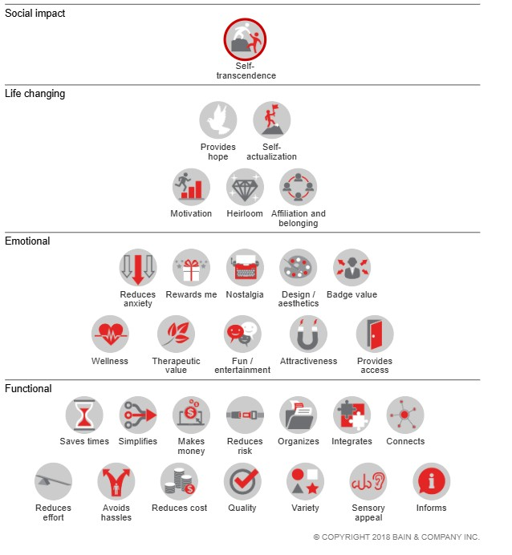

# Semana 4 — Mercado, valor y propuesta de valor

!!! abstract "Blueprint: Creación de valor → Captura de valor · DVF: 🔴 Deseable · 🟡 Viable"
    Esta semana conecta dos preguntas que los equipos suelen confundir: *¿qué valor crea mi producto?* y *¿por qué alguien me lo compra a mí y no a otro?* La primera es la propuesta de valor. La segunda es la diferenciación. Sin las dos claras, el pitch no funciona y el modelo de negocio no sostiene.

---

## Distribución de tiempo presencial

| # | Bloque | Contenido | Tiempo |
|---|--------|-----------|:------:|
| 1 | Cierre semana 3 | FTO + entrevistas + transición al mercado | 30 min |
| 2 | Segmento | De la solución técnica a la oportunidad de mercado | 15 min |
| 3 | Tipos de valor | Pirámide de Bain + marco IDEO | 10 min |
| 4 | Mercado | TAM / SAM / SOM con IA | 15 min |
| 5 | Competitivo | Directos, indirectos, sustitutos + Blue Ocean | 20 min |
| 6 | Workshop | Construir la propuesta de valor con IA | 20 min |
| 7 | Cierre | Propuesta de valor vs. oferta — la diferencia que importa | 10 min |
| | **Total** | | **120 min** |

!!! tip "Hilo conductor de la sesión"
    Cada bloque alimenta al siguiente. El segmento define para quién. La pirámide define qué tipos de valor existen. El TAM/SOM dice cuántos hay. El competitivo revela el hueco. El taller construye la propuesta de valor que ocupa ese hueco.

---

## Bloque 1 — Cierre semana 3
**Duración: 30 min**

### Propósito

Cerrar los tres hilos que quedaron como tarea: Freedom to Operate (FTO) de la vigilancia tecnológica, nombre de marca con la búsqueda fonética en IMPI, y síntesis de entrevistas. Conectar todo con el análisis de mercado que arranca hoy.

### Minuto a minuto

**Cierre de propiedad intelectual (10 min)**

Comparta en **60 segundos exactos** dos cosas:

1. El nombre de marca elegido después de la búsqueda fonética en el IMPI — y si encontraron antecedente, cómo lo están resolviendo
2. Su conclusión de **Freedom to Operate (FTO)**: el resultado de la vigilancia tecnológica — ¿pueden fabricar y vender su concepto en México sin infringir patentes vigentes?

```
Equipo | Nombre elegido | FTO (🟢/🟡/🔴) | Ajuste pendiente
```

**Freedom to Operate** es la conclusión de la vigilancia tecnológica de semana 3. Tres niveles:

- 🟢 **Alta** — no se encontraron patentes vigentes en México que cubran el mecanismo principal → pueden operar y construir con confianza
- 🟡 **Media** — hay patentes relevantes pero sus reclamos no cubren exactamente el concepto, o están caducadas → ajustar el concepto para alejarse de la cobertura y documentar la diferencia técnica
- 🔴 **Baja** — hay una patente vigente en México cuyos reclamos podrían cubrir el mecanismo principal → no invertir más sin asesoría legal especializada

Si algún equipo tiene FTO 🔴: no detenerse ahí en clase. Anotar el ajuste pendiente y continuar — el problema legal no se resuelve en el salón.

!!! warning "Si el IMPI devolvió un antecedente directo para el nombre de marca"
    No es el fin del proyecto. Tres opciones: (1) cambiar el nombre, (2) cambiar la clase de Niza, (3) buscar asesoría para evaluar coexistencia. 

---

**Síntesis de entrevistas**

Dos equipos comparten su síntesis — uno con concepto confirmado, uno con ajuste o pivote identificado. El instructor los selecciona antes de clase si ya recibió los reportes de tarea.

Formato: **2 minutos por equipo**, estructura fija:

```
1. ¿Qué hipótesis pusieron a prueba?
2. ¿Qué encontraron — confirmó, ajustó o pivotó?
3. La cita textual más importante de sus usuarios
4. Qué cambió en el concepto (o por qué se mantuvo igual)
```

Preguntas pendientes:

> *"¿Encontraron algo en sus entrevistas que contradijera lo que Perplexity o Claude les habían dicho en semana 2?"*

    Cuando los datos de mercado secundarios y la voz directa del usuario apuntan en direcciones distintas, la voz del usuario tiene la razón. Los datos secundarios describen tendencias. Las entrevistas describen comportamiento real de una persona real. Son cosas distintas.

!!! note "Si ningún equipo hizo las tres entrevistas"
    No fingir que pasó. Nombrar directamente:

    *"Las entrevistas son el insumo más valioso de todo el semestre. Sin ellas, el análisis de mercado que vamos a hacer hoy es especulación bien fundamentada — no validación. Hay una diferencia enorme entre los dos."*

    Dar 5 minutos al final del bloque para que los equipos sin entrevistas identifiquen por nombre a las 3 personas que van a entrevistar esta semana. No "alguien del sector" — un nombre, un teléfono, una cita agendada.

---

**MERCADO**


> *"Hasta ahora han respondido tres preguntas en secuencia: ¿existe un problema real? (semana 2), ¿pueden construir la solución sin bloqueos legales? (semana 3), ¿qué dicen los usuarios que tienen ese problema? (entrevistas). Hoy responden la cuarta — y es la que convierte una idea en un negocio: ¿cuánta gente tiene ese problema **y está dispuesta a pagar** por resolverlo, y por qué les van a comprar a ustedes y no a alguien más?"*


```
Semana 2 → ¿El problema existe?             (Deseable)
Semana 3 → ¿Pueden construirlo?             (Factible)
Semana 4 → ¿Hay mercado? ¿Por qué ustedes?  (Viable + Deseable)
```

El análisis de mercado no es un trámite académico — es la respuesta a la pregunta más difícil del emprendimiento.

---

## Bloque 2 — De la solución técnica a la oportunidad de mercado
**Duración: 15 min**

### Qué es un mercado — la definición que importa


> *"Philip Kotler define el mercado como el conjunto de compradores reales y potenciales de un producto o servicio. Esos compradores comparten una necesidad o deseo que puede satisfacerse mediante una relación de intercambio."*

**Compradores: gente dispuesta a dar algo a cambio de una solución.**

Esta distinción no es semántica. Un equipo puede tener miles de usuarios potenciales y cero mercado si nadie está dispuesto a pagar. Y al revés: un mercado pequeño con disposición real de pago puede sostener un negocio perfectamente viable.

> *"La pregunta no es '¿cuánta gente tiene este problema?' — es '¿cuánta gente tiene este problema **Y está dispuesta a pagar por resolverlo?'** Esas dos poblaciones rara vez son iguales. La diferencia entre ellas es la diferencia entre una causa social y un negocio."*

---

### La trampa del "producto solución"


El error más frecuente en equipos de ingeniería: construir algo porque *se puede*, no porque *se necesita*. El sensor existe porque la tecnología lo permite. La app existe porque el equipo sabe programarla. El producto es técnicamente impecable. Nadie lo compra.

Este patrón tiene nombre en la industria: ***solution looking for a problem*** (Una solución buscando un problema). Es la causa número uno de fracaso en productos de hardware, donde el costo de manufactura hace que el error sea especialmente caro. Un software que nadie usa puede abandonarse en un fin de semana. Un artefacto físico que nadie compra viene con inventario, proveedores, componentes pagados, y capital que no se recupera.

El problema no es la habilidad técnica del equipo — generalmente es excelente. El problema es la secuencia: primero construir, luego buscar a quién vendérselo. Esa secuencia invertida destruye más startups que la competencia, la tecnología y la falta de financiamiento juntos.

> *"¿Cuántas veces en las últimas dos semanas describieron su producto empezando con qué hace técnicamente, antes de decir para quién es y qué problema le resuelve?"*


> *"Si la respuesta es 'casi siempre' — están pensando como ingenieros de componentes. Lo que este curso busca construir es la otra mitad: pensar como **ingenieros de producto."***

---

### La mentalidad del ingeniero de producto exitoso

No es elegir entre habilidad técnica y entendimiento de mercado. Es la fusión de las dos — y esa fusión es exactamente el diferencial del mecatrónico frente a otros perfiles de emprendimiento.

El ingeniero de producto exitoso puede diseñar el circuito *y* entender por qué el usuario de ese circuito lo necesita. Puede escribir el firmware *y* saber cuánto está dispuesto a pagar el comprador de ese firmware. Puede optimizar el algoritmo *e* identificar en qué segmento ese algoritmo genera el mayor valor diferencial.

Esto no es teoría de negocios para ingenieros. Es lo que separa a los fundadores técnicos que construyen empresas de los que construyen proyectos de fin de carrera.

> *"Las habilidades técnicas ya las tienen — son extraordinarias. Lo que se agrega en este curso es la capa de entendimiento de mercado que convierte una solución técnica en un negocio. Un ingeniero que solo sabe construir crea productos. Un ingeniero que sabe construir y entiende el mercado crea empresas."*

---

### El análisis de mercado como pilar del desarrollo ágil

En desarrollo ágil, el principio más importante no es iterar rápido — es iterar sobre lo correcto. Iterar rápido sobre el producto equivocado solo lleva al fracaso más eficientemente, con mejor documentación del proceso.

El análisis de mercado es lo que define qué es lo correcto: quién es el usuario real, qué necesita específicamente, cuánto vale para él la solución, quién más lo está intentando. Sin esa información, el sprint planning es un ejercicio de optimismo bien organizado — el equipo trabaja duro, ejecuta bien, y produce algo que nadie necesitaba.

> *"Lean Startup no dice 'construye rápido'. Dice 'aprende rápido'. El análisis de mercado es aprender antes de construir — la iteración más barata que existe. Un cliente que te dice 'no pagaría por eso' en una entrevista de 20 minutos te ahorra tres meses de desarrollo."*

Los equipos que saltan directamente a construir sin análisis de mercado no son más ágiles — son más rápidos construyendo el producto equivocado.

---

### El segmento accionable — instrucción al grupo


Un segmento no es una categoría demográfica. "Agricultores mexicanos" no es un segmento — es una categoría de 3.2 millones de personas con contextos, recursos, problemas y comportamientos radicalmente distintos. **Un segmento accionable es un grupo suficientemente específico como para que el equipo pueda describir a un individuo concreto, encontrarlo en el mundo real, entrevistarlo, y diseñar específicamente para él.**

La especificidad no limita el mercado — lo hace real y abordable.

### El segmento accionable tiene cuatro capas

| Capa | Pregunta central | Lo que revela |
|------|-----------------|---------------|
| **Demográfica** | ¿Quién es, con suficiente detalle para encontrarlo? | Dónde buscarlos, cómo contactarlos, si existe concentración geográfica |
| **Conductual** | ¿Qué hace hoy para resolver el problema? | El workaround actual — lo que el producto tiene que desplazar |
| **Psicográfica** | ¿Qué le preocupa en sus propias palabras? | El lenguaje real del dolor — clave para comunicación y propuesta de valor |
| **Económica** | ¿Cuánto le cuesta el problema? ¿Quién decide la compra? | Si el mercado puede sostener el precio y quién hay que convencer |

---

### Del ejemplo: cómo se construye un segmento accionable

**Categoría:** "Agricultores mexicanos" — 3.2 millones de personas. No se puede entrevistar a ninguna en particular, no se puede diseñar para todas.

**Segmento accionable:**

> *"Productores de jitomate en invernadero en el corredor Tehuacán–Izúcar, con operaciones de 0.5 a 3 hectáreas, que contratan entre 5 y 20 jornaleros por temporada y riegan por goteo sin sistema automatizado de monitoreo."*

Esa oración describe a una persona que se puede encontrar en la agrotienda de Tehuacán un martes por la mañana, a quien se puede entrevistar en 20 minutos, y para quien se puede diseñar con precisión.


=== "Perfil del agricultor de invernadero"

  **CAPA 1 — DEMOGRÁFICA**
    - Productor de jitomate en invernadero · Tehuacán y corredor hacia Izúcar de Matamoros, Puebla
    - 38–55 años · Operación propia o familiar, no corporativa
    - 0.5 a 3 hectáreas · 5–20 jornaleros por temporada
    - Riego por goteo instalado (tiene infraestructura), sin automatización de monitoreo
    - Acceso a smartphone · usa WhatsApp diariamente

  **CAPA 2 — CONDUCTUAL**
    - Revisa la humedad del suelo caminando el invernadero cada mañana — toca la tierra con la mano o usa tensiómetro analógico si tiene
    - Decide cuándo regar basado en apariencia de la planta y experiencia propia ("se ve seca")
    - Registra el riego en una libreta o de memoria — raramente en app
    - Cuando hay un problema de riego ya visible (planta estresada, fruto deforme) el daño ya ocurrió — interviene tarde
    - Llama a su agrónomo de confianza 1–2 veces por ciclo, no más por costo

  **CAPA 3 — PSICOGRÁFICA**
    - *"Me preocupa llegar al invernadero y ver las plantas marchitas — eso me cuesta dinero que no recupero"*
    - *"No sé si estoy regando bien o me estoy pasando — el jitomate no te dice nada hasta que ya es tarde"*
    - *"No confío en tecnología que no entiendo — si me falla y pierdo una cosecha, ¿quién me responde?"*
    - Lo que lo motivaría a cambiar: ver que otro productor conocido lo usa y le funciona. La referencia entre pares vale más que cualquier demo o folleto.
    - Resistencia real: adopción lenta de nuevas herramientas, desconfianza si el vendedor no conoce el campo

  **CAPA 4 — ECONÓMICA**
    - Valor bruto por ciclo (90 días): $80,000–$250,000 MXN según hectáreas y precio del jitomate
    - Pérdida estimada por estrés hídrico mal gestionado: 10–20% del ciclo = $8,000–$50,000 MXN
    - Gasto actual en asesoría agronómica: $2,000–$5,000 MXN por visita, 1–3 visitas por ciclo
    - Disposición de pago estimada: hasta $800–$1,200 MXN/mes si confía en que funciona
    - Quién decide la compra: el dueño mismo — no hay área de compras, no hay proceso de aprobación

*"Lo que revela cada capa"*
| Capa | Lo que revela para el diseño del producto |
| ------ | ------------------------------------------ |
| **Demográfica** | El canal de distribución: agrotiendas en Tehuacán, no e-commerce. El idioma: español coloquial del campo, no tecnicismos. |
| **Conductual** | El workaround que hay que desplazar: la inspección manual diaria y el tensiómetro analógico. El producto entra exactamente ahí. |
| **Psicográfica** | El mensaje que funciona no es "tecnología de punta" — es "ya lo usa tu vecino y le funciona". La referencia entre pares es el canal de adopción. |
| **Económica** | $800–$1,200 MXN/mes es sostenible si evita una sola pérdida por estrés hídrico — el ROI se justifica solo. La decisión es rápida si el dueño confía. |

---

**Ejercicio:**

> *"Construyan el perfil de su segmento en estas cuatro capas usando únicamente lo que saben de sus entrevistas o de evidencia verificable. Si no tienen dato real para alguna capa, márcala explícitamente como hipótesis — no la inventen. Un perfil honesto con huecos es más útil que uno completo con datos fabricados: los huecos dicen exactamente qué investigar la semana que entra."*

**OJO** No describan al segmento que *quieren* tener, sino al que *tienen evidencia de conocer*. Esa es la distinción más difícil y la más importante del análisis de mercado.

---

### Prompt — Claude: perfil de segmento accionable

```
Actúa como un investigador de mercado con especialización en
segmentación de clientes para negocios de producto digital-físico
en mercados emergentes latinoamericanos. Tu metodología combina
datos demográficos verificables con análisis conductual y
psicográfico basado en comportamiento observable — nunca en
suposiciones sobre actitudes o valores generales. Cuando el
equipo no tiene evidencia de una capa, lo señalas directamente
en lugar de rellenar con hipótesis no marcadas. Un perfil honesto
con huecos es más útil que uno completo con datos inventados.

Somos emprendedores en México desarrollando un negocio que combina
una aplicación con IA, un artefacto físico inteligente y una
página web de venta. Hemos hecho entrevistas de validación:

INSIGHTS DE ENTREVISTAS (semana 3):
[pegar síntesis de entrevistas — incluir citas textuales]

SEGMENTO HIPÓTESIS DEL PAIN-GAIN MAP (semana 2):
[pegar segmento identificado]

OPORTUNIDAD EN UNA ORACIÓN:
[pegar la oportunidad del Pain-Gain Map]

Construye el perfil de segmento accionable en cuatro capas.
Para cada dato indica si es VERIFICADO (viene de entrevistas
o fuentes reales) o HIPÓTESIS (razonado pero sin confirmar).
Si una capa no tiene evidencia suficiente, indícalo —
no la inventes.

FORMATO DE SALIDA:

════════════════════════════════════════════════════════
PERFIL DE SEGMENTO ACCIONABLE
════════════════════════════════════════════════════════

CAPA 1 — DEMOGRÁFICA
¿Quién es con suficiente detalle para encontrarlo?
· [dato] → VERIFICADO / HIPÓTESIS
· [dato] → VERIFICADO / HIPÓTESIS

CAPA 2 — CONDUCTUAL
¿Qué hace hoy para resolver el problema — proceso exacto,
frecuencia, herramientas, workarounds?
· [dato] → VERIFICADO / HIPÓTESIS
· [dato] → VERIFICADO / HIPÓTESIS

CAPA 3 — PSICOGRÁFICA
¿Qué le preocupa en sus propias palabras?
¿Qué lo motivaría a cambiar de solución?
· [dato o cita textual] → VERIFICADO / HIPÓTESIS
· [dato o cita textual] → VERIFICADO / HIPÓTESIS

CAPA 4 — ECONÓMICA
¿Cuánto le cuesta el problema hoy?
¿Cuánto podría pagar? ¿Quién decide la compra?
· [dato] → VERIFICADO / HIPÓTESIS
· [dato] → VERIFICADO / HIPÓTESIS

────────────────────────────────────────────────────────
NIVEL DE CONOCIMIENTO DEL SEGMENTO:
Capas con mayoría VERIFICADA: [cuáles]
Capas con mayoría de HIPÓTESIS: [cuáles — agenda de investigación]

HIPÓTESIS CRÍTICAS SIN VERIFICAR:
[Las 2–3 suposiciones sin confirmar que más impactan
la viabilidad del negocio]

PERFIL EN UNA ORACIÓN:
[El segmento completo en una oración específica y concreta —
si no puede escribirse con datos verificados, señalarlo]
════════════════════════════════════════════════════════
```

!!! tip "Los huecos son información, no fracasos"
    Un equipo que identifica exactamente qué no sabe está mejor posicionado que uno que asume saberlo todo. Las hipótesis críticas sin verificar son la agenda de investigación de las semanas siguientes — no son un problema, son el mapa de lo que falta confirmar.

!!! warning "Señal de alerta"
    Si todas las capas salen como VERIFICADO después de 3 entrevistas, el equipo está confundiendo "escuchamos algo parecido" con "tenemos evidencia". Tres entrevistas confirman que el problema existe. No son suficientes para conocer el segmento con profundidad suficiente para diseñar para él.

---

## Bloque 3 — Tipos de valor: Pirámide de Bain + marco IDEO

**De la pirámide de Maslow a la pirámide de Bain**

Inspirándose en la pirámide de Maslow, y en línea con esta última idea de que nuestras acciones tienen como motor nuestras necesidades y que cada persona las prioriza de manera diferente, la firma Bain & Company se decidió a desarrollar su propia pirámide para tratar de identificar cuáles son las motivaciones qué siguen los consumidores para seleccionar un producto.

De este modo, en 2016 Bain & Company realizó un estudio que publico en la Harvard Business Review, que pretendía dar respuesta a la pregunta ¿Que motiva a los consumidores a la hora de escoger un producto?

La percepción que tienen nuestros consumidores respecto a cada producto cambia de forma radical y, por lo tanto, las estrategias a llevar a cabo para lograr vender más son completamente distintas. Bain & Company le da una vuelta de tuerca más a todo esto.

**Entendiendo la pirámide de Bain**

La pirámide de BAIN establece que un producto o servicio puede responder a cuatro tipos de necesidades y dentro de estas necesidades se identifican 30 valores. Cuantos más valores pueda defender una marca, más fieles van a ser sus consumidores.


{ width=600 align=center }


A continuación, se explica con mayor detalle la clasificación de los principales ámbitos de necesidad que cubren los productos o servicios para nuestros consumidores realizada por Bain&Company y una ilustración que muestra también los principales valores en cada ámbito:

**Funcional – ¿Para qué lo quiero?**
Los valores más básicos que como consumidores pedimos a un producto: información, variedad, calidad, capacidad de ahorrar tiempo, capacidad de reducir esfuerzo, etc. Aquí podemos encontrar la mayoría de productos que encontramos en un supermercado, pero también algunos servicios como podría ser Glovo, que nos permite elegir comida de un montón de restaurantes diferentes y te la traen a casa.

**Emocional – ¿Qué me aporta?**
En este segundo nivel se activan valores que conectan con los sentimientos de los consumidores: bienestar, acceso a un determinado grupo o comunidad, hacernos más atractivos o reducir nuestra ansiedad. Muchas grandes marcas están trabajando este tipo de valores para establecer un vínculo mayor con sus consumidores. Por ejemplo, comprar un producto Apple significa mucho más que disponer de un móvil.

**Cambio de vida – ¿Me ayuda a ser mejor?**
Valores relacionados con la motivación para conseguir retos, esperanza o sentimiento de pertinencia. Las marcas deportivas siempre han intentado cubrir estos valores poniendo énfasis en qué sus productos te ayudarán a lograr tus retos (parece que correrás más rápido con unas Nike o que será muy difícil prepararte para una maratón sin un reloj deportivo como un Garmin).

**Impacto social – ¿Es capaz de trascender logrando una sociedad mejor?**
En la cima de la pirámide encontramos lo que podemos llamar como de auto-trascendencia, es decir, ayudar a los demás o mejora la sociedad. Por ejemplo, WaterMarks es una empresa de fotografía que, por cada fotografía descargada con su marca de agua, realiza una inversión considerable en proyectos sociales de agua potable [Fuente](https://lareuniondelas9.wordpress.com/2020/04/11/la-piramide-de-bain/)

La pirámide tiene cuatro niveles. Los productos operan principalmente en uno, pero los más exitosos tocan varios simultáneamente:

```
              ╔════════════════════════╗
              ║    IMPACTO SOCIAL      ║ ← El producto conecta al usuario
              ║                        ║   con algo más grande que él mismo:
              ╚════════════════════════╝   una causa, una comunidad, un legado

           ╔══════════════════════════════╗
           ║      TRANSFORMADOR           ║ ← Cambia fundamentalmente cómo
           ║                              ║   el usuario vive o trabaja —
           ╚══════════════════════════════╝   no mejora algo, lo redefine

        ╔════════════════════════════════════╗
        ║          EMOCIONAL                 ║ ← Reduce ansiedad, genera
        ║                                    ║   tranquilidad, da sentido
        ╚════════════════════════════════════╝   de logro, bienestar, estatus

     ╔══════════════════════════════════════════╗
     ║              FUNCIONAL                   ║ ← Ahorra tiempo, reduce costo,
     ║                                          ║   minimiza riesgo, mejora
     ╚══════════════════════════════════════════╝   calidad o accesibilidad
```

**La regla de la pirámide:** un producto necesita ser sólido en el nivel funcional antes de reclamar valor emocional. Si promete tranquilidad pero no funciona de manera confiable, la promesa emocional destruye la marca. Los mejores productos operan simultáneamente en funcional y emocional — el funcional justifica la compra, el emocional genera lealtad.


Construir una propuesta de valor sin saber qué tipos de valor existen produce propuestas genéricas que describen características del producto, no el valor que entrega.

La diferencia en una línea:

```
"Nuestro sensor monitorea la humedad del suelo en tiempo real"
→ Descripción técnica. Oferta.

"El agricultor deja de perder el 20% de su cosecha porque
ya sabe cuándo regar sin adivinar"
→ Resultado para el usuario. Propuesta de valor.
```

La diferencia no está en las palabras — está en el punto de vista. La primera describe el producto desde adentro. La segunda describe el resultado desde la perspectiva del usuario. Ese cambio de perspectiva es el que construye propuestas de valor reales.

Para hacer ese cambio con criterio, el equipo necesita entender qué tipos de valor existen y en cuál opera su producto.

---


**Aplicado al tipo de productos que el grupo desarrolla:**

| Producto | Valor funcional | Valor emocional |
|----------|----------------|-----------------|
| Sensor de humedad para agricultores | Reduce pérdida de cosecha hasta 20% por riego mal calculado | Elimina la incertidumbre de "¿estoy regando bien?" que acompaña cada ciclo |
| Monitor de calidad de aire en espacios de trabajo | Detecta CO₂ elevado que reduce productividad y concentración | Tranquilidad de saber que el equipo trabaja en un ambiente que cuidas |
| Sistema de monitoreo de máquinas en talleres | Reduce paros no planeados que detienen producción y generan reproceso | El dueño deja de llegar cada mañana temiendo encontrar producción parada |

El valor emocional no es marketing — es la razón por la que los usuarios recomiendan el producto a otros y por la que tolera un precio premium.

---

### El marco IDEO: Insightful / Unique / Targeted


| **INSIGHTFUL** | **UNIQUE** | **TARGETED** |
|:--------------:|:----------:|:------------:|
| ¿Qué necesitan realmente tus clientes? | ¿Qué puedes hacer tú que... | ¿Quién es ese cliente que será |
| ¿Necesidades que tus competidores | ...nadie más puede hacer? | *súper* apasionado con |
| no están cubriendo? | ...es difícil que otros hagan? | tu negocio? ¡Descríbelo! |

---

- **Insightful:** ¿Qué necesitan realmente tus clientes que los competidores actuales no están dando? No lo que el equipo cree que necesitan — lo que reveló la investigación de campo.
- **Unique:** ¿Qué puede hacer este equipo que es difícil de replicar? Aquí entran las capacidades técnicas específicas — conocimiento del sector, tecnología dominada, acceso a distribución, experiencia directa con el usuario.
- **Targeted:** ¿Quién es ese cliente que va a ser *súper* apasionado con el producto? No todos los que tienen el problema — el segmento donde el producto genera el mayor valor diferencial y donde el equipo tiene ventaja real.

> *"IDEO no empieza con el producto — empieza con el insight del cliente y la singularidad de la solución. La propuesta de valor vive en la intersección de esas tres preguntas. Un producto Insightful pero no Unique es copiable. Unique pero no Targeted no encuentra a su usuario. Targeted pero no Insightful no resuelve nada real."*

**La diferencia clave que el debes llevarte:**

```
OFERTA     → Qué vendes
             "Un sensor de humedad de suelo con app conectada
             y alertas en tiempo real"
             Puede existir sin cliente. La pueden copiar mañana.

PROPUESTA  → Por qué alguien te lo compra a TI y no a otro
DE VALOR    "El único sistema que le dice al agricultor de
             pequeña escala exactamente cuándo regar su parcela
             específica, por menos de lo que le cuesta una semana
             de asesoría que solo pasa una vez por semana"
             Solo existe en relación a un usuario y un competidor.
             Es difícil de copiar porque viene de quiénes son,
             qué saben y a quién sirven.
```

---

## Bloque 4 — TAM / SAM / SOM con IA
**Duración: 15 min · Min 0:55 – 1:10**

### Para qué sirve y para qué no sirve

El TAM/SAM/SOM no es un ejercicio de precisión estadística — es un ejercicio de pensamiento estructurado. Nadie conoce con exactitud el tamaño de un mercado naciente. Lo que sí se puede calcular es el orden de magnitud y si el mercado es suficientemente grande para justificar construir un producto.

Un equipo que puede razonar sobre el tamaño de su mercado con lógica verificable demuestra que entiende dónde opera. Un equipo que presenta un TAM enorme sin justificación demuestra que no entiende dónde opera.

```
TAM — Total Addressable Market
¿Cuánta gente en el mundo tiene este problema
y estaría dispuesta a pagar por resolverlo?
El universo teórico máximo si el producto llegara a todos.

SAM — Serviceable Addressable Market
¿A cuántos puedes llegar con tu modelo de negocio actual?
La geografía donde operas, el canal que tienes,
el idioma que hablas, el precio que cobras —
todo eso reduce el TAM al segmento que realmente puedes servir.

SOM — Serviceable Obtainable Market
¿A cuántos puedes llegar realísticamente en los primeros 2 años
con los recursos que tienes?
Generalmente 1–5% del SAM para una startup early-stage.
El número que importa: ¿es suficiente para sostener el negocio?
```

!!! danger "La trampa más común — el TAM aspiracional"
    Los equipos presentan un TAM enorme para impresionar y un SOM sin ninguna lógica de cómo llegar a esos usuarios. Un inversionista lee ese SOM y entiende que el equipo no tiene plan de go-to-market.

    **El SOM es el número que más importa.** El TAM y SAM dan contexto del mercado potencial. El SOM dice si el equipo tiene claridad sobre cómo va a crecer en el tiempo que tiene.

### Demo del instructor — construir el razonamiento en vivo (3 min)

El instructor hace el ejercicio con el ejemplo del sensor agrícola para que el grupo vea la lógica de construcción, no solo los números:

```
TAM: ¿Cuántos agricultores con este problema existen en México?
     → INEGI Censo Agropecuario: 5.3M unidades de producción
     → De esas, pequeña escala (menos de 5 ha): ~3.2M
     → Con acceso a smartphone (proxy de conectividad): ~60% = 1.9M
     → Dispuestos a pagar por tecnología de monitoreo: ~15% = 285K
     TAM estimado: 285,000 agricultores × $1,200 MXN/año = $342M MXN

SAM: ¿A cuántos podemos llegar con nuestro modelo actual?
     → Operamos solo en México (no LATAM todavía)
     → Canal directo vía agrotiendas en Sonora, Sinaloa, Guanajuato
     → Estados con agricultura intensiva de riego: ~40% del TAM
     SAM: ~115,000 agricultores × $1,200 MXN = $138M MXN

SOM año 1–2: ¿A cuántos podemos llegar con nuestros recursos?
     → Un equipo de 4, sin fuerza de ventas, 2 estados piloto
     → Meta realista vía 3 agrotiendas piloto: 2,000 agricultores
     → Justificación: 3 tiendas × 700 clientes activos cada una
     SOM: 2,000 agricultores × $1,200 MXN = $2.4M MXN/año
```

Lo que el instructor señala: la lógica de cada reducción es lo que hace creíble el número. No es el resultado — es el razonamiento.

### Prompt — Perplexity: TAM/SAM/SOM con fuentes reales

```
Actúa como analista de mercado con especialización en
dimensionamiento para startups de hardware y software en
América Latina. Tu metodología es el enfoque top-down
con triangulación de fuentes verificables: INEGI, CEPAL,
BID, reportes de industria con autor y año identificables.
No inventes cifras — si no existe fuente verificable para
un número, lo señalas y explicas cómo estimarlo con
lógica de primer principio.

Somos emprendedores en México:

Concepto: [nombre + descripción en 2–3 oraciones]
Segmento objetivo: [perfil accionable del Bloque 2 —
  incluyendo las 4 capas]
Precio estimado del producto/servicio: [rango en MXN]
Modelo de ingresos: [venta única / suscripción mensual /
  suscripción anual / freemium con upsell]
Mercado inicial: México
Expansión potencial: LATAM en año 3+

Construye TAM, SAM y SOM con este razonamiento explícito:

TAM: Universo total con el problema Y disposición de pago.
No solo "cuántos tienen el problema" — cuántos pagarían.
Mostrar la reducción paso a paso con fuente de cada número.

SAM: El subconjunto alcanzable con el modelo actual.
Especificar exactamente qué lo reduce: geografía, canal,
precio, idioma, tamaño mínimo de cliente.

SOM: La porción realista en los primeros 2 años.
Justificar el porcentaje con lógica de go-to-market concreta:
cuántos vendedores, qué canal, qué geografía piloto.
El número sin lógica no sirve.

FORMATO DE SALIDA:

════════════════════════════════════════════════════════
DIMENSIONAMIENTO DE MERCADO
Concepto: [nombre]
════════════════════════════════════════════════════════

TAM — Mercado Total Direccionable
Universo de partida: [n° y descripción]
  ↓ Filtro [descripción]: [n° resultante] · Fuente: [nombre]
  ↓ Filtro [descripción]: [n° resultante] · Fuente: [nombre]
Universo final TAM: [n° personas o negocios]
Valor anual: [$ MXN] · Supuesto de precio: [$ por usuario/año]

SAM — Mercado Alcanzable
Filtros aplicados al TAM:
  · [filtro]: reduce a [n°]
  · [filtro]: reduce a [n°]
Universo SAM: [n°]
Valor anual: [$ MXN]

SOM — Mercado Obtenible (años 1–2)
Meta: [n° clientes]
Porcentaje del SAM: [%]
Lógica de go-to-market:
  · [canal específico]
  · [geografía piloto]
  · [capacidad del equipo]
Valor anual: [$ MXN]

────────────────────────────────────────────────────────
SEÑAL DE VIABILIDAD:
SOM × precio anual = [$ MXN]
¿Cubre costos operativos básicos de una startup de 4 personas?
Sí / No / Marginal — [1 oración de justificación]

FUENTES UTILIZADAS:
· [fuente 1 con año]
· [fuente 2 con año]
════════════════════════════════════════════════════════
```

!!! note "Si el SOM sale muy pequeño"
    No es una señal de fracaso automáticamente. Un SOM de 500 clientes pagando $12,000 MXN/año es $6M MXN — perfectamente viable para una startup de 4 personas con estructura de costos delgada. El problema no es el número pequeño; es cuando el costo de adquisición de cada cliente (tiempo, viajes, demos) destruye el margen antes de llegar a escala.

---

## Bloque 5 — Análisis competitivo y Blue Ocean
**Duración: 20 min · Min 1:10 – 1:30**

### La lógica del bloque — por qué el competitivo antes de la propuesta de valor

La propuesta de valor no existe en el vacío — existe en relación a dos cosas: un usuario específico y un competidor específico. Sin competidores mapeados, la propuesta de valor queda flotando como afirmación unilateral. La diferenciación solo es visible cuando hay algo respecto a lo cual diferenciarse.

Este bloque tiene tres capas que se construyen en secuencia:

**Capa 1 — Listado de competidores (5 min):** quiénes son — directos, indirectos y sustitutos — y cuál es la debilidad específica de cada uno para el segmento del equipo.

**Capa 2 — Mapa de posicionamiento (7 min):** dónde están esos competidores en el espacio precio-calidad y dónde hay huecos visibles.

**Capa 3 — Blue Ocean (8 min):** qué atributos eliminar, reducir, incrementar y crear para ocupar un espacio donde nadie compite directamente.

### Los tipos de competidores — y por qué el más peligroso no es el directo

```
DIRECTOS
Mismo producto, mismo problema, mismo usuario.
Los que aparecen en la misma búsqueda de Google.
→ Fáciles de identificar, fáciles de analizar.

INDIRECTOS
Diferente producto, mismo problema.
Lo que el usuario usa HOY aunque no sea lo ideal.
→ El más peligroso: ya tiene la confianza del usuario
  y el hábito instalado. Desplazarlo cuesta más que
  ganarle a un competidor directo.

SUSTITUTOS
El usuario podría resolver el problema sin un producto
similar al tuyo — cambiando su comportamiento o proceso.
→ Define el piso de precio: si el sustituto es gratis
  o muy barato, el producto tiene que justificar su costo
  con valor claramente superior.
```

> *"El competidor más peligroso casi nunca es el directo. Es el indirecto — lo que el usuario ya paga para resolver el problema, aunque sea mal. Desplazar un hábito instalado es mucho más difícil que ganarle a alguien que llegó al mismo tiempo que tú."*

!!! note "Porter's 5 Fuerzas — mención de 2 minutos"
    Existe un framework clásico llamado las 5 Fuerzas de Porter que analiza la estructura competitiva de industrias maduras: poder de negociación de proveedores y clientes, amenaza de nuevos entrantes, amenaza de sustitutos, rivalidad entre competidores. Lo van a usar en cursos de estrategia avanzada y es muy útil para entender cómo está estructurado un sector.

    Para lo que hacen hoy — un producto en primera iteración buscando dónde tiene ventaja — no es la herramienta correcta: les describe cómo está el campo de juego pero no les dice dónde parase. Para eso: Blue Ocean.

### Prompt — Perplexity: mapa competitivo

```
Actúa como analista de inteligencia competitiva especializado
en mercados de producto digital-físico en América Latina.
Tu metodología identifica tres capas de competidores con
énfasis en actores reales y con tracción observable —
no en listados genéricos de industria ni en productos
que no han lanzado. Para cada competidor buscas su debilidad
específica para el segmento del equipo, no sus debilidades
generales.

Somos emprendedores en México con un negocio que combina
una aplicación con IA, un artefacto físico inteligente
y una página web de venta.

Concepto: [nombre + descripción en 2–3 oraciones]
Segmento objetivo: [perfil accionable — las 4 capas]
Dolor ⭐ que resolvemos: [del Pain-Gain Map]
Precio estimado: [rango en MXN]

Mapea los tres tipos con evidencia real y observable:

DIRECTOS (mínimo 3): misma solución, mismo usuario
INDIRECTOS (mínimo 3): diferente solución, mismo problema
SUSTITUTOS (mínimo 2): cómo resuelve el usuario sin
  ningún producto similar al nuestro

Para cada competidor:
· Nombre y descripción en 1 oración
· Dónde opera: México / LATAM / global
· Precio o modelo de ingresos si está documentado
· Su debilidad específica para nuestro segmento
  (no debilidades genéricas — específicas para este usuario)

FORMATO DE SALIDA:

════════════════════════════════════════════════════════
MAPA COMPETITIVO
Segmento: [nombre del segmento]
════════════════════════════════════════════════════════

DIRECTOS
1. [Nombre] — [descripción] — [opera en] — [precio] — [debilidad específica]
2.
3.

INDIRECTOS
1. [Nombre] — [descripción] — [opera en] — [precio] — [debilidad específica]
2.
3.

SUSTITUTOS
1. [Comportamiento sustituto] — [costo para el usuario en tiempo o dinero]
2.

────────────────────────────────────────────────────────
EL COMPETIDOR MÁS PELIGROSO:
[El indirecto o sustituto más arraigado en el comportamiento
actual del usuario, por qué es difícil de desplazar, y qué
tendría que ofrecer una solución nueva para que el usuario
cambie de comportamiento]
════════════════════════════════════════════════════════
```

### Mapa de posicionamiento — dónde están los competidores en el espacio (7 min)

Con los competidores identificados, el instructor dibuja en pizarrón o proyecta el mapa de posicionamiento: un eje de dos dimensiones que ubica a cada jugador en el espacio precio-calidad.

```
CALIDAD
  ↑
  │  Consultoría         Sistema IoT
  │  agronómica     ●    industrial ●
A │  presencial
L │
T │              ❓HUECO❓
A │
  │  Tensiómetro              App
  │  analógico ●         genérica ●
B │
A │
J │
A │
  └──────────────────────────────────→ PRECIO
       BAJO                    ALTO
```

**Las cuatro zonas del mapa:**

| Zona | Precio | Calidad | Quién está ahí para el sensor agrícola |
|------|--------|---------|----------------------------------------|
| ↗ Superior derecha | Alto | Alta | Sistemas IoT industriales, consultoría agronómica presencial |
| ↘ Inferior derecha | Alto | Baja | Apps genéricas de clima o riego sin sensor físico |
| ↙ Inferior izquierda | Bajo | Baja | Tensiómetro analógico, inspección manual |
| ↖ Superior izquierda | Bajo | Alta | **El hueco — nadie está aquí** |

> *"El mapa de posicionamiento les dice dos cosas en 30 segundos: dónde están parados sus competidores y dónde está el espacio vacío. En este caso el hueco está en la esquina superior izquierda — calidad alta, precio accesible. Ese es el espacio que un producto bien diseñado para este segmento puede ocupar sin competir directamente con nadie."*

**Instrucción al grupo:**

Cada equipo dibuja su propio mapa en papel — ejes precio y calidad, competidores ubicados, y una X marcando dónde pretenden estar ellos. No hay respuesta correcta universal — lo que importa es que el equipo pueda justificar por qué se posiciona donde se posiciona y que ese espacio no esté ya saturado.

> *"Si su X está en la misma esquina que tres competidores directos, tienen un problema de diferenciación — no de producto. El producto puede ser bueno; la pregunta es por qué alguien los elegiría a ustedes y no a quien ya está ahí."*

**Las dimensiones no tienen que ser siempre precio-calidad.** Dependiendo del concepto, puede ser más revelador usar:
- Precio vs. facilidad de uso
- Precisión vs. tiempo de implementación
- Costo de adopción vs. impacto en el negocio del usuario

El criterio para elegir los ejes: ¿cuáles son las dos dimensiones que más le importan al segmento objetivo cuando toma la decisión de compra?

---

### Blue Ocean — el lienzo estratégico (8 min)

El instructor explica el marco completo antes del prompt — no solo el lienzo, sino la lógica que lo produce:

**¿Por qué existe el océano rojo?**

> *"Todas las industrias empiezan con un océano azul — alguien inventó algo nuevo y no había competencia. Con el tiempo, más empresas entran al mismo espacio, compiten por los mismos clientes con las mismas métricas, y el océano se tiñe de rojo. La guerra de precios es el síntoma: cuando nadie puede explicar por qué es diferente, el precio es lo único que queda para competir."*

> *"La trampa es que todos los competidores terminan ofreciendo prácticamente lo mismo porque se copian mutuamente. Mejoran en los mismos atributos que sus rivales. Nadie pregunta si esos atributos siguen siendo lo que el usuario realmente valora."*

**Las cuatro acciones de Blue Ocean**

Blue Ocean Strategy no es solo "ser diferente" — tiene una metodología concreta para encontrar dónde diferenciarse. Se llama el Marco de las Cuatro Acciones:

```
ELIMINAR  → ¿Qué atributos que todos los competidores ofrecen
             deberían eliminarse porque el usuario ya no los
             valora, aunque la industria los dé por sentado?

REDUCIR   → ¿Qué atributos deberían reducirse muy por debajo
             del estándar de la industria porque se han
             exagerado al servir a un usuario que ya no los necesita?

INCREMENTAR → ¿Qué atributos deberían elevarse muy por encima
              del estándar de la industria porque el usuario
              los valora pero nadie los está dando bien?

CREAR     → ¿Qué atributos completamente nuevos debería
             introducirse que la industria nunca ha ofrecido
             y que el usuario valoraría mucho?
```

> *"Un océano azul real usa las cuatro acciones simultáneamente. Eliminar y reducir reduce costos. Incrementar y crear aumenta el valor para el usuario. El resultado es una curva de valor radicalmente diferente a la de todos los competidores — y un modelo de negocio que no compite en precio porque no hay con quién compararse directamente."*

**Ejemplo aplicado al sensor agrícola — el instructor lo hace en vivo:**

El instructor proyecta esto mientras lo explica:

```
Los competidores directos (sistemas de monitoreo IoT agrícola)
compiten en estos atributos:
· Precisión del sensor (todos dicen tener la mejor)
· Cantidad de sensores por paquete (más es mejor)
· Conectividad (WiFi, LoRa, celular)
· Dashboard de datos (más gráficas, más métricas)
· Precio del hardware (todos bajan)
· Soporte técnico (todos prometen 24/7)

¿Qué haría Blue Ocean con esto?

ELIMINAR:  el dashboard complejo de métricas que el agricultor
           no entiende ni usa — nadie le enseñó a leerlo

REDUCIR:   la cantidad de sensores por paquete — con 2 bien
           colocados es suficiente, 8 es overkill para una
           hectárea de invernadero

INCREMENTAR: la simplicidad de la alerta — en lugar de datos
             crudos, el sistema dice "riega hoy" o "no riegues"
             en lenguaje que cualquier jornalero puede ejecutar

CREAR:     asesoría agronómica integrada al producto —
           el sistema no solo detecta, recomienda qué hacer
           basado en el cultivo específico y la etapa del ciclo
```

> *"¿Ven lo que pasa? La curva de valor de este concepto es completamente diferente a la de los competidores directos. No compite en precisión del sensor ni en cantidad de métricas — compite en simplicidad de decisión y en conocimiento agronómico integrado. Esos dos atributos son su océano azul."*

**Cómo se lee la tabla que produce Claude:**

El output del prompt es una tabla de puntuaciones del 1 al 5 por atributo. El instructor guía al grupo para interpretarla con tres preguntas:

**1. ¿Dónde son todas las columnas de los competidores parecidas?**
Ahí está el océano rojo — todos compiten en lo mismo con niveles similares. Entrar a competir en esos atributos significa guerra de precios.

**2. ¿Dónde la columna del concepto es radicalmente diferente a todas las demás?**
Esa diferencia es el océano azul potencial. Puede ser alta donde los competidores están bajos (atributo nuevo o muy superior), o baja donde todos están altos (atributo que el concepto deliberadamente elimina porque el segmento ya no lo valora).

**3. ¿Hay alguna columna del concepto que puntúa igual que los competidores?**
Ahí hay riesgo de océano rojo — si no hay diferencia en ese atributo, el usuario no tiene razón para elegir el concepto sobre lo que ya conoce.

Aplicado al ejemplo del sensor agrícola, la lectura sería:

| Atributo | Competidor IoT | Competidor app | Nuestro concepto |
|----------|:--------------:|:--------------:|:----------------:|
| Precio accesible | 2 | 4 | **5** |
| Cantidad de sensores | 5 | 1 | 2 |
| Dashboard de datos | 5 | 3 | 1 |
| Alerta simple ("riega hoy") | 1 | 2 | **5** |
| Asesoría agronómica integrada | 1 | 1 | **5** |
| Soporte técnico | 4 | 2 | 3 |

> *"¿Ven lo que pasa? En precio, alerta simple y asesoría integrada nuestra curva es completamente diferente a la de los competidores. En dashboard de datos estamos deliberadamente bajos — no porque no podamos hacerlo, sino porque ese atributo no le sirve a este usuario. Ahí está el océano azul: no competimos en los mismos atributos que los demás."*

### Prompt — Claude: lienzo estratégico Blue Ocean

```
Actúa como estratega de innovación con experiencia en Blue
Ocean Strategy aplicada a startups de hardware y software
en mercados emergentes latinoamericanos. Tu especialidad es
construir lienzos estratégicos que revelan la diferenciación
real — no la que el equipo quiere ver sino la que los datos
del mercado sugieren. Aplicas el Marco de las Cuatro Acciones
(Eliminar / Reducir / Incrementar / Crear) antes de construir
el lienzo, porque el lienzo es la consecuencia del marco,
no el punto de partida. Cuando el equipo no tiene ventaja en
un atributo, lo puntúas bajo — la honestidad del lienzo es
su único valor real.

Tenemos este mapa competitivo:
[PEGAR el output completo del prompt de Perplexity del
  mapa de competidores — directos, indirectos, sustitutos]

Nuestro concepto: [nombre + descripción técnica en 3–4 oraciones]

Capacidades diferenciales del equipo:
[qué puede hacer este equipo que es difícil de replicar:
  conocimiento del sector, tecnología dominada, acceso a
  distribución, experiencia directa con el usuario objetivo]

Segmento accionable:
[pegar el perfil de las 4 capas del Bloque 2]

Con estos insumos construye el lienzo estratégico en dos pasos:

PASO 1 — MARCO DE LAS CUATRO ACCIONES:
Antes de construir el lienzo, aplica el marco para identificar
cómo debería posicionarse el concepto:

ELIMINAR: ¿Qué atributos que todos los competidores ofrecen
debería eliminar el concepto porque el segmento objetivo ya
no los valora, aunque la industria los dé por sentado?
Mínimo 1 atributo concreto con justificación.

REDUCIR: ¿Qué atributos debería ofrecer muy por debajo del
estándar de la industria porque se han exagerado al servir
a un perfil de usuario diferente al nuestro?
Mínimo 1 atributo concreto con justificación.

INCREMENTAR: ¿Qué atributos debería elevar muy por encima
del estándar de la industria porque el segmento objetivo
los valora pero nadie los está dando bien?
Mínimo 1 atributo concreto con justificación.

CREAR: ¿Qué atributos completamente nuevos podría introducir
el concepto que ningún competidor ofrece y que el segmento
valoraría significativamente?
Mínimo 1 atributo concreto — basado en las capacidades
diferenciales del equipo, no en especulación.

PASO 2 — LIENZO ESTRATÉGICO:
Con los atributos identificados en el Marco de las Cuatro
Acciones, construye la tabla de puntuación y la curva de valor.
Incluye los atributos donde los competidores son fuertes
(para mostrar dónde el concepto deliberadamente no compite)
y los atributos nuevos o incrementados (para mostrar el hueco).

FORMATO DE SALIDA:

════════════════════════════════════════════════════════
LIENZO ESTRATÉGICO BLUE OCEAN
Concepto: [nombre] · Segmento: [perfil en una oración]
════════════════════════════════════════════════════════

MARCO DE LAS CUATRO ACCIONES

ELIMINAR — el concepto no ofrecerá:
· [atributo]: [por qué el segmento ya no lo valora aunque
  todos lo ofrezcan]

REDUCIR — el concepto ofrecerá muy por debajo del estándar:
· [atributo]: [por qué está exagerado en la industria y
  no sirve a este segmento]

INCREMENTAR — el concepto ofrecerá muy por encima del estándar:
· [atributo]: [por qué el segmento lo valora y nadie lo da bien]

CREAR — el concepto introducirá por primera vez:
· [atributo nuevo]: [por qué el segmento lo valoraría y
  qué capacidad del equipo lo hace posible]

────────────────────────────────────────────────────────
ATRIBUTOS DEL LIENZO:
[Lista de 6–8 atributos que incluye: los que los competidores
usan para competir + los nuevos del Marco de las Cuatro Acciones]

1. [atributo] — [qué mide concretamente]
2.
[hasta 8]

TABLA DE PUNTUACIÓN (1=muy bajo · 5=muy alto):

| Atributo             | [Comp A] | [Comp B] | Nuestro concepto |
|----------------------|:--------:|:--------:|:----------------:|
| [atributo 1]         |    /5    |    /5    |       /5         |
[completar para todos los atributos]

Nota: los atributos ELIMINADOS puntúan 0 para el concepto.
Los atributos CREADOS puntúan 0 para todos los competidores.

────────────────────────────────────────────────────────
LECTURA DEL LIENZO:

La curva del concepto es diferente a la de los competidores en:
[atributos donde hay diferencia significativa — mínimo 3]

El océano azul en una oración:
[por qué esta combinación específica de atributos crea un
espacio donde el concepto no tiene competencia directa]

ADVERTENCIA DE OCÉANO ROJO:
[Si hay algún atributo donde el concepto puntúa igual que
los competidores — señalarlo con el riesgo específico de
terminar compitiendo en precio en esa dimensión]

PREGUNTA CLAVE PARA EL EQUIPO:
[La hipótesis más importante que el lienzo asume y que
debería verificarse con usuarios reales antes de comprometer
recursos en esa dirección]
════════════════════════════════════════════════════════
```

!!! tip "El Marco de las Cuatro Acciones es más importante que el lienzo"
    El lienzo es una visualización. El marco es el pensamiento estratégico. Un equipo que puede articular qué elimina, reduce, incrementa y crea — y por qué — entiende su posicionamiento. Un equipo que solo llenó la tabla no necesariamente lo entiende.

!!! warning "El atributo CREAR es el más difícil y el más valioso"
    Casi todos los equipos identifican fácilmente qué incrementar. Pocos identifican qué crear — un atributo genuinamente nuevo que ningún competidor ofrece. Ese atributo casi siempre viene de las capacidades técnicas específicas del equipo aplicadas a una necesidad del usuario que nadie había conectado con tecnología todavía.

---

## Bloque 6 — Workshop: la propuesta de valor
**Duración: 20 min · Min 1:30 – 1:50**

### El momento de síntesis de cuatro semanas

Todo lo que el equipo ha construido desde semana 2 converge en este bloque:

```
¿Quién es el usuario?      → Perfil accionable (Bloque 2)
¿Qué dolor tiene?          → Pain-Gain Map (semana 2)
¿Qué tipos de valor existen? → Pirámide de Bain (Bloque 3)
¿Cuántos usuarios hay?     → TAM/SAM/SOM (Bloque 4)
¿Dónde está el hueco?      → Blue Ocean (Bloque 5)

PROPUESTA DE VALOR =
el valor específico que el producto entrega al usuario
en el hueco donde los competidores tienen su debilidad
```

La propuesta de valor no se inventa — emerge de cruzar lo que el usuario necesita (validado en entrevistas), lo que nadie está dando bien (revelado en el competitivo), y lo que el equipo puede hacer de forma diferencial (sus capacidades técnicas específicas).

### Instrucción al grupo (2 min)

> *"Tienen 12 minutos con Claude para construir su propuesta de valor. El prompt les va a pedir que traigan los outputs de los bloques de hoy — no improvisen. Todo lo que necesitan ya lo construyeron esta sesión. Al final tienen 6 minutos para que cada equipo presente únicamente su Versión 3 — la más fuerte — en voz alta al grupo. Sin contexto adicional. Solo la propuesta."*

### Prompt — Claude: propuesta de valor

```
Actúa como estratega de marca y comunicación con experiencia
construyendo propuestas de valor para productos de hardware
y software en etapa early-stage en mercados latinoamericanos.
Tu metodología combina el framework Insightful/Unique/Targeted
de IDEO con la Pirámide de Valor de Bain: una propuesta sólida
opera en el nivel funcional como mínimo, aspira al emocional,
y es articulable en una oración que cualquier persona puede
memorizar y repetir sin haber visto el producto.

Los criterios que no negocias:
✅ Nombra al usuario específico — no "nuestros clientes"
✅ Nombra el resultado concreto que obtiene — no la feature
✅ Implica por qué esta solución y no otra disponible
❌ No usa: plataforma, solución integral, innovador,
   de última generación, revolucionario, ecosistema
❌ No describe el producto — describe el valor que entrega

Somos emprendedores en México con un negocio que combina
una aplicación con IA, un artefacto físico inteligente
y una página web de venta.

Insumos del análisis de hoy:

PERFIL DE SEGMENTO (Bloque 2):
[pegar el perfil completo con las 4 capas]

DOLOR ⭐ Y GANANCIA ⭐ (semana 2 — Pain-Gain Map):
Dolor: [el más intenso]
Ganancia: [la más deseada]

COMPETIDOR MÁS PELIGROSO Y SU DEBILIDAD (Bloque 5):
[pegar del mapa competitivo]

HUECO AZUL IDENTIFICADO (Bloque 5):
[pegar del lienzo Blue Ocean]

PRECIO ESTIMADO: [rango en MXN]

Con estos insumos construye la propuesta de valor en tres pasos:

PASO 1 — NIVEL EN LA PIRÁMIDE DE BAIN:
¿En qué nivel opera principalmente el concepto hoy?
¿Hay oportunidad de subir un nivel sin exagerar o
sin comprometer lo que el producto puede entregar?

PASO 2 — VALIDACIÓN IDEO:
· Insightful: ¿el concepto resuelve algo que los
  competidores no están dando para este segmento?
· Unique: ¿qué puede hacer este equipo que es
  difícil de replicar por otros?
· Targeted: ¿el segmento está definido con precisión
  suficiente para que la propuesta le hable directamente?

PASO 3 — TRES VERSIONES:
Máximo 25 palabras cada una. En español.

FORMATO DE SALIDA:

════════════════════════════════════════════════════════
PROPUESTA DE VALOR
Concepto: [nombre]
════════════════════════════════════════════════════════

NIVEL EN PIRÁMIDE DE BAIN:
Nivel actual: [Funcional / Emocional / Transformador]
Justificación: [1 oración específica]
Oportunidad de subir: [sí — cómo / no — por qué]

EVALUACIÓN IDEO:
Insightful ✅/⚠️/❌ — [1 línea]
Unique     ✅/⚠️/❌ — [1 línea]
Targeted   ✅/⚠️/❌ — [1 línea]

────────────────────────────────────────────────────────
VERSIÓN 1 — FUNCIONAL:
"[propuesta de valor]"
Fuerza: [qué la hace creíble]
Limitación: [por qué podría quedarse corta]

VERSIÓN 2 — EMOCIONAL:
"[propuesta de valor]"
Fuerza: [qué la hace resonar]
Riesgo: [cuándo podría sonar exagerada]

VERSIÓN 3 — LA MÁS FUERTE:
"[propuesta de valor]"
Por qué esta es la más fuerte: [2 oraciones — qué combina
  que las otras dos no lograban juntas]

────────────────────────────────────────────────────────
OFERTA vs. PROPUESTA DE VALOR:
Oferta del producto (qué venden):
"[descripción técnica de qué hace el producto]"

Propuesta de valor (por qué lo compran):
"[Versión 3]"

La diferencia en una línea:
[qué cambia entre las dos — el punto de vista, el sujeto,
el nivel de la pirámide, la referencia al competidor]
════════════════════════════════════════════════════════
```

### Presentaciones rápidas (6 min)

Cada equipo lee en voz alta únicamente su **Versión 3**. Sin contexto adicional, sin explicar el producto antes, sin preparar al grupo. Solo la propuesta de valor.

El instructor hace una sola pregunta después de cada una — la misma para todos:

*"¿Nombra al usuario? ¿Nombra el resultado? ¿Implica por qué ustedes y no otro?"*

Si las tres respuestas son sí: aprobada. Puede continuar al Bloque 7.
Si falla en alguna: el equipo la refina durante el Bloque 7 y la presenta como tarea.

**Señal de que va bien:**
El grupo puede repetir la propuesta de valor de otro equipo inmediatamente después de escucharla — sin haberla visto escrita. Si nadie puede repetirla, no es memorable.

**Señal de alerta:**
Una propuesta de valor que requiere 30 segundos de contexto antes de poder leerse no es una propuesta de valor — es un resumen ejecutivo. El instructor pide al equipo que elimine todo el contexto y deje solo la oración.

---

## Bloque 7 — Cierre: oferta vs. propuesta de valor
**Duración: 10 min · Min 1:50 – 2:00**

### El concepto que se llevan — sin slides, solo voz

El instructor cierra de pie, sin proyector:

> *"Hoy construyeron algo que la mayoría de los ingenieros confunde durante toda su carrera. Voy a decirlo dos veces porque quiero que lo repitan hasta que quede grabado:"*

```
OFERTA     → Lo que vendes
             Puede existir sin cliente.
             Describe el producto desde adentro.
             La pueden copiar mañana con el mismo stack.

PROPUESTA  → Por qué alguien te lo compra a TI y no a otro
DE VALOR    Solo existe en relación a un usuario específico
             y a un competidor específico.
             Describe el resultado desde afuera — desde el usuario.
             No la pueden copiar fácilmente porque viene de
             quiénes son, qué saben, y a quién sirven mejor.
```

> *"Una empresa sin propuesta de valor clara compite en precio. Siempre. No porque quiera — porque no puede explicar por qué vale más que el siguiente. Y competir en precio es una carrera al fondo que los más grandes siempre ganan porque tienen más capital para aguantar."*

---

### Los tres errores más comunes — reconocerlos es parte del aprendizaje

!!! danger "Error 1 — Confundir feature con valor"
    **Feature:** *"Nuestra app tiene notificaciones en tiempo real con alertas configurables."*

    **Valor:** *"El agricultor sabe exactamente cuándo actuar antes de perder la cosecha — no el día siguiente cuando ya es tarde."*

    La feature describe lo que hace el producto. El valor describe lo que cambia en la vida del usuario. La feature puede replicarse. El valor, si está bien articulado, es mucho más difícil de imitar porque está atado a un segmento específico.

!!! danger "Error 2 — Dirigirse a todos"
    Una propuesta de valor para todos no es una propuesta de valor — es un folleto de marketing. Cuanto más específico el usuario, más poderosa la propuesta porque habla exactamente de su situación, no de una situación genérica que podría ser de cualquiera.

    El miedo a especificar viene de pensar que acotar el segmento reduce el mercado. Lo que en realidad hace es aumentar la tasa de conversión — el usuario que se siente perfectamente descrito compra sin fricción.

!!! danger "Error 3 — No mencionar la alternativa"
    Si la propuesta de valor no implica *"en lugar de X"*, no hay diferenciación real — solo una afirmación de valor que el usuario no puede verificar contra nada.

    El usuario siempre tiene una alternativa, aunque sea no hacer nada. La propuesta de valor más fuerte nombra implícitamente esa alternativa y muestra por qué el producto es superior en el contexto específico del usuario.

### Pregunta de cierre

El instructor antes de terminar:

*"¿Cuál de los tres errores cometía su primera versión de la propuesta de valor — la de antes de pasar por Claude?"*

Dejar que el grupo responda en voz alta. No hay respuesta incorrecta. El propósito es que cada equipo pueda nombrarlo — porque si pueden nombrarlo, pueden evitarlo la próxima vez sin necesitar el prompt.

---

## Tarea en casa (4 horas)

| Tarea | Tiempo | Entregable |
|-------|:------:|-----------|
| Refinar la propuesta de valor si no fue aprobada en clase | 30 min | Versión final con los tres criterios cumplidos |
| Canvas de mercado completo | 1.5h | Segmento + TAM/SAM/SOM + mapa competitivo + lienzo Blue Ocean + propuesta de valor — todo en una página |
| Mínimo 3 entrevistas adicionales si no se completaron | 1.5h | Síntesis con el prompt de semana 3 — hipótesis verificadas o refutadas |
| Leer la propuesta de valor en voz alta a alguien fuera del equipo | 30 min | ¿Esa persona pudo repetirla inmediatamente? ¿Entendió quién es el usuario y qué obtiene? |

### Canvas de mercado — estructura del entregable

```
CANVAS DE MERCADO — Semana 4
Equipo: _________________________ Concepto: _________________________

1. SEGMENTO ACCIONABLE
   Demográfica: [descripción específica]
   Conductual:  [qué hace hoy / workaround actual]
   Psicográfica: [qué le preocupa en sus propias palabras]
   Económica:   [costo del problema / disposición de pago / quién decide]
   Hipótesis críticas sin verificar: [las más importantes]

2. TAMAÑO DE MERCADO
   TAM: [número y valor] · Fuente: [nombre]
   SAM: [número y valor] · Filtros: [cuáles]
   SOM año 1-2: [número y valor] · Lógica: [canal + geografía]

3. MAPA COMPETITIVO
   Directos (3):    [nombre / debilidad específica]
   Indirectos (3):  [nombre / debilidad específica]
   Sustitutos (2):  [comportamiento / costo para el usuario]
   El más peligroso: [cuál y por qué]

4. LIENZO BLUE OCEAN
   Atributos (6–7): [lista]
   Tabla de puntuación: [ver formato del prompt de Claude]
   El hueco azul en una oración: [dónde la curva es radicalmente diferente]

5. PROPUESTA DE VALOR
   Oferta (descripción técnica): [qué venden]
   Propuesta de valor (≤25 palabras): [Versión 3 del prompt]
   Nivel en pirámide de Bain: [Funcional / Emocional / Transformador]
   Error que cometía la primera versión: [cuál de los tres]
```

---

## Lo que el equipo debe poder responder al salir sin consultar notas

- [ ] ¿Cuál es la diferencia entre su oferta y su propuesta de valor en una oración?
- [ ] ¿Quién es el competidor más peligroso de su concepto y cuál es su debilidad específica para su segmento?
- [ ] ¿En qué atributo su curva de valor es radicalmente diferente a la de todos sus competidores?
- [ ] ¿Su propuesta de valor nombra al usuario específico, el resultado concreto, y por qué ellos y no otro?

